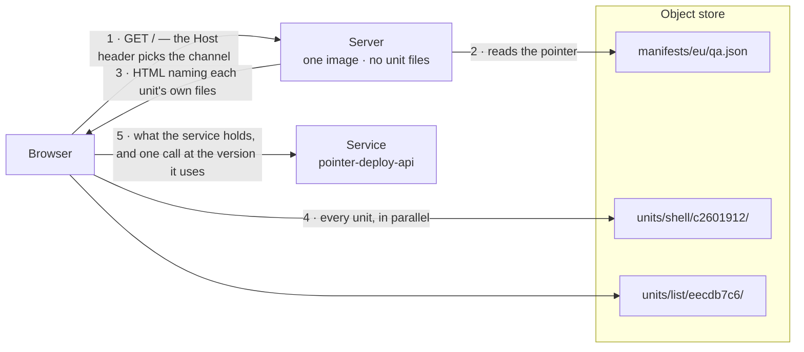

# The Pointer-Deploy Approach

The vast majority of work on an SPA tends to be outside of the web server, sometimes called a Backend For Frontend, yet it is a common practice to make building, publishing and deploying the server an integral part of shipping all changes. This is slow and wasteful. Under the pointer-deploy approach, the server holds no application files, so shipping a change has no need to build or change the container at all. Instead, we use a CDN hosted JSON file of mappings to other CDN hosted files. When we update files we “publish” them by updating the mapping which is consumed by clients.

Live: <https://pointer-deploy.fly.dev/>

---

## Clarifying what we mean by different terms


| Term | What it means |
| --- | --- |
| **Unit** | One independently shipped piece of the page, with its own bundle, stylesheet and id. **One** on this slate: the **shell**. `PLAN.md` steps 1, 4 and 5 add three sub-apps back, one per step. |
| **Shell** | The frame. It owns the title, the sidenav, routing, the shared state, and the slots the sub-apps render into. |
| **Sub-app** | One panel on the page. Built, published and deployed on its own. |
| **Object store** | A Tigris bucket on Fly, `pointer-deploy-assets`. It contains all published unit's files, every channel's pointer and the catalogue. |
| **Publish** | Upload a unit's files to the object store. Nobody sees any change. Nothing to undo. |
| **Channel** | An environment. Four: `qa`, `prod`, and two the test suite owns. The request's `Host` header picks one. |
| **Pointer manifest** | `manifests/<region>/<channel>.json` — the live id for each unit, one file per channel per region. Channels are environments and differ on purpose. A region can move alone, though both normally match and one promote writes both. Called the **pointer** below. |
| **Composition** | The set of unit ids one page was assembled from. |
| **Promote** | The deploy. It writes a new pointer, and does nothing else. |
| **Contract** | The type surface between the shell and a sub-app. Its identity is a hash of its own content. |
| **Server** | The one container image that serves the page. It reads a pointer and writes HTML, and holds no unit files. |
| **Service** | A second separate app, `pointer-deploy-api`, deployed on its own schedule. It answers the page's data — one greeting, over two routes — and publishes what it holds and what it is retiring. |
| **Browser** | The visitor's browser. It fetches each unit from the store, checks every file against the digest the page declared, and calls the service itself. |

---

## Where the application is now

The page is a title, a fixed sidenav and five views, and one of them places a unit: `/` draws `list`, which is every task the planner holds. `/board` and `/week` are waiting for one; `/service` is drawn by the frame itself, from the one reading it took of the service, and `/backup` will be drawn by the frame too. A view naming no unit is a legitimate view: the frame draws it, and nothing is fetched for it. Desktop only, and there is no breakpoint anywhere in the stylesheet.

The tasks are in memory and nowhere else, which is `PLAN.md` step 1 rather than an omission: IndexedDB is step 2, so a reload starts the planner empty and the panel says so on the page.

That is deliberately almost nothing. The slate was cleared on 2026-09-10: the five demo sub-apps and the counters they shared came out, the object store was emptied, and the pointer manifest was written again from one build. `PLAN.md` step 0 then removed the last sub-app and step 1 added `list`. What is left is the machinery — publishing, composing, promoting, rolling back, refusing a composition that cannot work — and that is the subject.

**Examples naming `hello` below are readings taken before step 0.** They are real and they were taken against that tree; what this one builds is `shell` and `list`. TODO §31 lists what is still waiting for a third unit, and `PLAN.md` says which step gives it back.

What gets built on this slate is documented as it is built. The process is the thing being shown, more than whatever the application turns out to be.

---

## The problem this solves

A normal single-page-app pipeline treats the application and the server that delivers it as one deploy artefact. Change a button label, and you build a container image, push it to a registry, and roll out new machines. Rolling back means doing all of that again with an older commit or perhaps swapping out the container image with an older one.

One artefact means:

- An hour of building and deployment for a one-word change.
- Full rollback is a second full pipeline run, so recovery is as slow as release.
- Rolling back one thing, means rolling back everything.

### What about bundle splitting and module federation?

Bundle splitting and deploy splitting are solutions to different problems: the former is about application loading performance while the latter is about publishing changes in isolation. Multiple entry-points and lazy chunks divide the code the browser loads but leaves the pipeline with exactly the same problems. Module federation achieves the async fetching of “remotes” at runtime, so it offers that part of the machinery where “remotes” **could** ship without the host. However, it does not offer a clear path to granular deployments or compatible versioning. The primary advantage of module federation is to handle module assets federally – that is to use a clever and efficient, but **monolithic**, approach to building an application so that the individual parts have exactly everything they need and the chunks can be loaded async at browser runtime.

The application and the server do not have to be monolithic and coupled by using only one artefact or one build process or one deployment.

---

## How it works

### The four moving parts

The pointer manifest and the unit catalogue are files in the object store, so they are contents rather than parts.

| Part | Job |
| --- | --- |
| **Object store** | Holds every published unit's files under `units/<name>/<id>/`, the live composition per channel under `manifests/<region>/<channel>.json`, and every reachable unit id at `units/catalogue.json` |
| **Server** | Reads its channel and region's pointer, writes HTML naming each unit's own files, and serves the catalogue at `GET /units` |
| **Service** | Answers the page's data over two routes, and publishes which versions it serves and which fields it retires. One `POST` changes what the panel draws, with no deploy |
| **Browser** | Fetches each unit from the store on first load only, checks every file against the digest the page declared, then calls the service itself |

### One request, end to end



The server reads one small JSON file and nothing else. Every unit directory was written at a different time, and the pointer is the only thing that joins them. `units/catalogue.json` is read from cache only, so a cold or missing catalogue costs an override its target and the visitor no wait.

### The whole deploy

```sh
bun run build                             # every unit into dist/units/
bun run publish                           # uploads only what changed, and rebuilds the catalogue
bun run promote qa --from-build           # the deploy. Every id read from dist/build.json
bun run promote qa --app list=eecdb7c6    # one unit by id. Same command
bun run promote qa --app list=36226fb9    # the rollback. Same command
bun run promote qa --shell c2601912       # the shell alone
bun run units                             # which ids there are to name
```

Nobody memorises a hash. `publish` prints the new ids on stdout as JSON, so a script pipes them straight into `promote`; an operator promoting the build they just made types no id at all. Every **other** id — every unit ever published, whether or not a channel was ever pointed at it — is in `units/catalogue.json`, which `publish` writes and `bun run units` prints. The origin reads the same file through `GET /units`, so a query string can name a build before it is deployed rather than only after.

`fly deploy` is **not** in that list. The server image is rebuilt only when the *server* changes, which is a different and much rarer event.

### The three rules that make it safe

- **`promote` merges, it does not replace.** It reads the channel's current composition, applies only what you named, and writes the result. Without the merge, "deploy list" would silently roll every other unit back to whatever the operator last had on disk.
- **`publish` writes the unit's own descriptor last**, after every file it names is readable. `promote` refuses a unit without one, so a channel can never point at a half-uploaded unit.
- **A unit id is the hash of that unit's output, and nothing else.** The commit is deliberately excluded: one commit touching only `list` would otherwise change every id and republish every unit. Publishing is therefore idempotent per unit — everything untouched reports `unchanged`.

---

## The requirements, and how each is met

The `.feature` files **are** the requirements. They are also the acceptance suite — one artefact, never paraphrased into a separate test. Every row names the file that holds it and how many scenarios stand behind it; the list under each table says how it is met.

### A. Ship without a rebuild

| Requirement | Asked by | Evidence |
| --- | --- | --- |
| A deploy changes which build a channel points at — no image build, no rollout | Operator | `deploying-by-pointer.feature`, 5 scenarios |
| Ship a change to one unit without moving the others | Operator | `deploying-a-unit.feature`, 8 scenarios |
| One server image serves every environment | Operator | `channel-selection.feature`, 3 scenarios |
| A published build is permanent, so a page loaded before a deploy still fetches its files | Operator | `publishing-a-build.feature`, 6 scenarios |

- **Changing which build a channel points at** — `promote` writes one JSON object. Machine ids and timestamps are **asserted identical** before and after.
- **Shipping one sub-app** — each unit has its own id, directory and asset base. `promote --app list=<id>` merges into the current composition.
- **One image, every environment** — `Host` selects the channel, `FLY_REGION` the region. Both are pure functions.
- **A permanent build** — files are written under a content-hash id and never overwritten. A deploy deletes nothing.

### B. Separate bundles still behave as one application

| Requirement | Asked by | Evidence |
| --- | --- | --- |
| The frame and the panel agree about what the page holds, though the bundles were built separately | Visitor | `keeping-a-list-of-tasks.feature`, 8 scenarios, in a real browser |
| One panel failing costs me that panel alone | Visitor | `recovering-from-an-error.feature`, 3 scenarios |
| I see the version live now, never one frozen into the server image | Visitor | `serving-the-shell.feature`, 7 scenarios |

- **One shared state** — the shell, the store and each shared library land in one chunk; every sub-app is built with those specifiers **external**, and the page's import map joins them up. `build.ts` refuses a sub-app that bundled its own copy.
- **One panel failing** — a sub-app is a Preact component inside the shell's tree, so the shell's error boundary catches what it throws. A separate render root caught nothing.
- **The version live now** — the server reads the pointer per request, cached 10 s and served stale while it refreshes.

> **Why this was not assumed:** bundling the UI library into each sub-app was tried on the previous slate, which had five of them. It turned 4 of the 6 browser scenarios red, because each sub-app got its own reactivity runtime and the shell's state silently stopped re-rendering it.

### C. A rollback that actually works

Composing units means composing combinations nothing has ever type-checked. A shell that renamed an export, put in front of a six-week-old `list`, is a page where one panel renders an error. Three mechanisms answer that.

| Requirement | Asked by | Evidence |
| --- | --- | --- |
| A composition that cannot work is refused before it reaches visitors | Operator | `bun run e2e:members`, real store; 5 falsify mutations |
| An additive change must not force every unit to republish | Developer | `contract:matrix`, every unit × retained contracts, ~0.4 s |
| See what a rollback would serve before anyone else does | Operator | `choosing-a-version.feature`, 7 scenarios |
| Rolling back to an older manifest schema must still render | Operator | `rolling-back-onto-an-older-schema.feature`, 2 scenarios |

- **Refusing a composition that cannot work** — each unit records **which members of the shell's surface it uses**, measured by removal: cut the declaration, recompile, see whether it still builds. `promote` refuses a sub-app needing a member this shell lacks, and names both.
- **An additive change** — contract identity is a content hash. An added export still satisfies every retained contract, so nothing republishes; a breaking change shows at once as a `fail` column in `bun run contract:matrix`.
- **Seeing a rollback first** — `?list=<id>` on the origin's own URL composes that unit for you alone, and moves no channel. An id the channel never served is refused, and so is a composition that cannot work.
- **Previewing a pull request** — CI builds it with `BUILD_MARKER=pr-<number>` and publishes; the same URL then runs it, because `qa` is the one real channel that admits that marker. `promote` still refuses it, so a preview can be looked at and never deployed. It is not a feature flag: nothing picks for a visitor who did not type the URL, and flags live in the service.
- **An older manifest schema** — a schema 2 manifest is kept in the store permanently, with a test channel pointed at it, in a real browser.

> **Why a hash and not a version number:** a number is a claim somebody has to remember to raise, and nothing stops an edit to a published contract from silently breaking every unit that claimed the old one. A hash is derived, so that edit produces a *different* identity, which no unit claims.

### D. Nothing unintended reaches visitors

| Requirement | Asked by | Evidence |
| --- | --- | --- |
| The browser refuses any file whose bytes were not published | Visitor | `checking-what-the-page-loads.feature`, 4 scenarios, 3 executable in a real browser |
| Running the suites and then deploying must not ship a scenario's build to visitors | Operator | `refusing-a-harness-build.feature`, 3 scenarios |
| A well-formed manifest must not quietly put an older commit in front of visitors | Operator | `refusing-a-stale-build.feature`, 5 scenarios |

- **Refusing a file** — two mechanisms, neither sufficient alone: a **sha384 digest per file**, travelling with the unit so it survives a rollback; and a **content security policy** from the manifest, allowing the inline import map by the hash of its own bytes. Three of the four scenarios need a real browser, because whether a browser *refuses* a file is observable nowhere else.
- **A harness build** — harness builds carry a marker. `promote` refuses one on `qa` or `prod`, and accepts it on the suite's `test-*` channels.
- **A stale build** — each build records its source. `promote` compares it against `HEAD` and refuses a stale or uncommitted build, printing an override for the deliberate case.

### E. Operating it

| Requirement | Asked by | Evidence |
| --- | --- | --- |
| A store outage degrades the deploy system, not the application | Visitor | `store-outage.feature`, 7 scenarios |
| A machine in another region must not go on serving what it served before | Operator | `serving-from-two-regions.feature`, 4 scenarios against the deployed machines |
| Decide a sunset from traffic rather than from a guess | Operator | `counting-what-is-served.feature`, 6 scenarios |
| Know whether the page can use the service it reads from | Operator | `reading-from-a-service.feature`, 3 scenarios; `bun run e2e:api`, 12 checks |
| Mark a contract as going away | Developer | `bun run e2e:deprecation`, real store; 16 unit tests |
| See what is inside the service, and what it is retiring | Operator | `reading-what-the-service-holds.feature`, 8 scenarios; `bun run e2e:schema`, in a real browser |
| Change what the page offers, without deploying anything | Operator | `reading-what-the-service-holds.feature`, 3 scenarios; `bun run e2e:schema` |
| Know which unit a change to the service will reach | Developer | `contract:members`, 26 members; the claims asserted in `members.test.ts` |
| Read that retirement on the page, without deploying anything | Visitor | `bun run e2e:schema`; 3 falsify mutations |
| Delete old files without breaking an open tab | Operator | `scripts/retention.ts`; measured live 2026-08-30 |

- **A store outage** — a running server survives on its last good pointer, and `/healthz` reads no pointer, so an outage cannot make the platform kill healthy machines.
- **Another region** — **one promote writes every region.** Two regions that already differ stop a promote rather than being flattened; only `--region us` makes them differ.
- **Deciding a sunset** — `GET /compositions` reports every composition this origin handed out, split by whether a query string composed it — otherwise one operator reads as visitors still on an old unit.
- **Using the service** — the shell records which API versions it accepts, the service publishes what it serves, and the **running server** intersects them into a response header. The page never waits: it renders from defaults and fills in afterwards.
- **A contract going away** — `contract:deprecate` records a reason, a date and what to move to, beside the hash and never inside it. It **warns and never refuses**, because published units were built against the deprecated contract.
- **What the service holds** — the service publishes the fields of every version it answers; `API_DEPRECATED` in its environment retires one, with no code change and no rebuild. Responses carrying a retired field say so, in RFC 9745 `Deprecation` and RFC 8594 `Sunset`. A value it cannot act on stops it starting, because a mistaken "nothing is going away" is a false reading rather than silence.
- **Changing what the page offers** — the service answers two fields over two routes, one of them writable. A single `POST` changes what it holds, on every channel that reads that service, with nothing rebuilt and no id moved. No unit draws that resource on this slate — the planner's tasks are in the browser — so the claim that a PAGE changes for such a write gets its subject back at `PLAN.md` step 6, when the service starts holding the planner's snapshots. A greeting with no text is refused, because it is a value no page could draw.
- **Which unit a change reaches** — ownership is measured at the field, never the resource. `readMembers` cuts one declaration — `Limits.allowNegative`, not `Limits` — and recompiles each unit, so `bun run contract:members` prints which panel needs which field. Nothing declares it, so nothing can get it wrong.
- **Reading a retirement on the page** — the shell reads the document once and hands it to every panel through the store, so a separately published sub-app reports it without calling the service itself. `list` asks about `snapshot.tasks`, which the service does not answer until step 6, so nothing is drawn for it today and `bun run e2e:members` is what holds the call. No unit id moves between the reading before a retirement and the reading after.
- **Deleting old files** — `bun run sweep` removes only what no channel can serve, behind a **90-day floor** on two clocks: the object's age, and when a channel stopped serving it.

---

## What this changes for each role

| Role | What is different |
| --- | --- |
| **Designers** | A visual change to one panel ships and rolls back on its own, never queueing behind unrelated work in the same release. A URL shows any previously deployed build of any panel, without deploying it. |
| **Product managers** | The unit of release is a panel. "Ship the panel, hold the frame" is a real operation, never a feature flag. Rollback is the deploy command, and takes seconds rather than a pipeline run. What is still served is a number you read at `/compositions`. |
| **Engineering managers** | Deploy risk is separate from infrastructure risk: an application change means no image build, no rollout, no machine churn. A machine refuses a composition that cannot work before a visitor sees it. Every requirement is a scenario, seen to fail before it was trusted. |
| **Developers** | Publish is cheap and idempotent per unit; promote is the only thing anyone sees. A breaking change to the shell↔sub-app surface shows as a failing column in a matrix at build time, never in a browser weeks later. Additive changes force no republish. |

---

## What it costs — measured, not estimated

| | Value |
| --- | --- |
| Promotion to every visitor seeing it | **8.8 – 9.1 s** on this slate, 4.7 – 10.2 s across eight runs on the previous one |
| Propagation window by construction | **15 s** (5 s store pointer cache + 10 s server cache) |
| First request to a fully stopped machine | 4.59 s (wake, boot, cold pointer read) |
| First request to a running machine | 0.32 s |
| Runtime image | 40 MB, no dependencies, no build output |
| Type-checking added to every build | ~14 s, for the contract's 26 members and the server-to-shell surface's 13 |

**A deploy is fast, not instant.** Two caches sit in front of it, and both are deliberate: the pointer cache is what makes the store cheap, and the server cache is what keeps a visitor from ever waiting on a store read.

---

## Deliberate limits

These are decisions, not gaps. Each is written down so nobody mistakes it for an oversight.

| Limit | Why it is accepted |
| --- | --- |
| Old units are never deleted on a deploy | A tab opened before the deploy still fetches its files. Deletion is a separate, floored sweep |
| A unit cannot be composed with any other | `promote` refuses a sub-app needing a member this shell lacks. That refusal is the feature |
| The shell owns where a sub-app appears on the page | A layout change is a shell publish and a promote, and rolling the shell back rolls the layout back |
| A change in behaviour behind an unchanged type is not caught | No type surface can cover it, and saying so beats implying otherwise |
| A library major version that breaks an old bundle is not caught | Folding library versions into the contract hash would republish every sub-app on every patch bump. Versions are recorded and **warned** about |
| The API service surface is checked coarsely | It has no compiler behind it. A version set compared at serve time replaces one, and a version set is coarser than a type |
| Anyone who can write the pointer can serve an older composition | The digest and the policy stop them running their own code on the origin. The remaining hole is the bucket key's scope |
| Two promotes at once can lose one | Read-modify-write with no compare-and-set. One operator today; an `If-Match` on the ETag would close it |

---

## How it is verified

Green checks are a necessary condition for shipping and never a sufficient one, so this project carries several independent kinds of evidence.

| Layer | What it covers | Size |
| --- | --- | --- |
| `bun test` | Pure logic: the server, the build-time web code, the scripts, the service, the harness | **424 tests**, ~22 s |
| `bun run verify` | Scenarios needing an injected failure — unreachable store, corrupt manifest, a retired field | **54** `@local` scenarios, ~8 s |
| `bun run verify:live` | Everything that publishes or promotes, against the **real** store and deployed machines | **45** `@live` scenarios |
| `bun run verify:browser` | What only a browser sees: two bundles agreeing on one store, a blocked module script, a panel that throws | **13** `@browser` scenarios |
| `bun run falsify` | 92 deliberate breakages. **Each must turn a named check red** | 92 mutations, 65 run locally, 0 uncaught |
| `bun run mutate` | Operator and literal mutation over the server's pure logic and the service | 1205 mutants. `src/server` **895 of 895**; `api/service.ts` 268 of 310 |
| `bun run e2e` | Deploy the panel, deploy the frame, roll the panel back, read off the **rendered page** | the question the project exists to answer |
| `bun run e2e:schema` | Retire a field on the service, write another, read what the page paints — no unit rebuilt, no id moved | in a real Chrome |

**100 written scenarios** (106 executable, three being outlines) are the specification and the acceptance suite at once.

Four conventions hold the whole thing up:

- The `.feature` files are the specification **and** the acceptance suite. Never paraphrase one into a separate test.
- Anything that publishes or promotes runs against the **real** store. A stub reimplementing them could pass while the real path was broken.
- **Every new scenario must be seen red before it is trusted.** `bun run falsify` exists for this, and has found three checks that proved nothing.
- The suite deploys, so it deploys **somewhere else**: two channels the application is served from, two the suite owns, with a tripwire that fails a run if a real channel moved.

> **`falsify` earns its keep.** Writing five mutations for the member gate found two faults in the *checks* rather than in the code — a scenario asserting only a member's name, which both halves of the gate print; and a search string matching two places, so a mutation patched the wrong one and was reported as caught. `falsify` now refuses any search that matches more than one place.

---

## Not done

| | What it needs |
| --- | --- |
| A browser-reachable `prod` URL | A domain pointed at Fly, and a certificate. The channel works today via the `Host` header |
| Asset retention on a schedule | `bun run sweep` has its 90-day floor and runs by hand. A timer needs a key that can delete — the production-origin key the CI item waits on |
| Contract pruning | Retention is by hand, on purpose. Pruning is a decision, never automatic |
| Concurrent promotes | A conditional write (`If-Match` on the ETag) |
| A count of what is still **running** | `/compositions` counts what was handed out. The rest needs a route that accepts a write, and a production bucket key |


