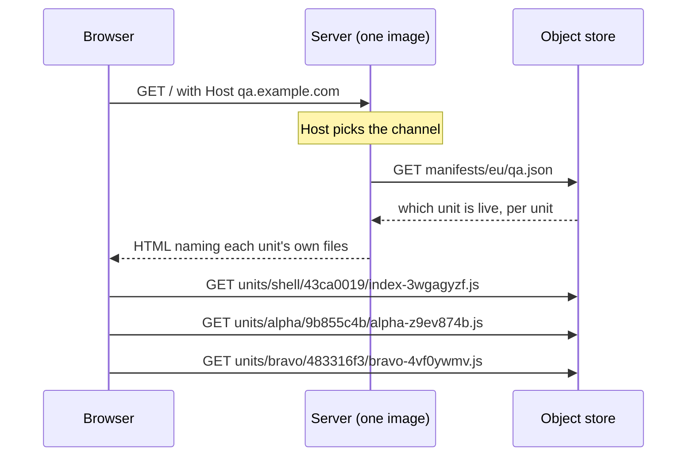

# pointer-deploy — what it does, and how each requirement is met

The server holds none of the application's files, so shipping a change writes one JSON file instead of building a container, pushing it, and replacing machines.

Live: <https://pointer-deploy.fly.dev/>

---

## 1. The words


| Term | What it means |
| --- | --- |
| **Unit** | One independently shipped piece of the page. There are five: the **shell** and four **sub-apps** (alpha, bravo, charlie, delta). Each has its own bundle, its own stylesheet, and its own id. |
| **Shell** | The frame. It owns routing, the shared state, and the slots the sub-apps render into. |
| **Sub-app** | One panel on the page. Built, published and deployed on its own. |
| **Publish** | Upload a unit's files to the object store. Nobody sees any change. Nothing to undo. |
| **Channel** | An environment. There are four: `qa`, `prod`, and two the test suite owns. The request's `Host` header picks one. |
| **Pointer manifest** | One small JSON file naming which unit id is live for each of the five units. One per channel, because the channels are the environments and hold different compositions on purpose. One per region within that, so a single region can be moved on its own — but both regions normally hold the same composition, and one promote writes both. Store key: `manifests/<region>/<channel>.json`. Called the **pointer** for short below. |
| **Composition** | The set of five unit ids one page was assembled from. |
| **Promote** | The deploy. It writes a new pointer, and does nothing else. |
| **Contract** | The type surface between the shell and a sub-app. Its identity is a hash of its own content. |

---

## 2. The problem this solves

A normal single-page-app pipeline treats the application and the server that delivers it as one deploy artefact. Change a button label, and you build a container image, push it to a registry, and roll out new machines. Rolling back means doing all of that again with an older commit or perhaps swapping out the container image with an older one.

One artefact means:

- An hour of building and deployment for a one-word change.
- If a team would benefit from exhaustive e2e tests, then all teams pay that price.
- If every team would benefit from exhaustive e2e tests, then CI time increases by the number of teams.
- Full rollback is a second full pipeline run, so recovery is as slow as release.
- Rolling back one thing, means rolling back everything.

### What about bundle splitting and module federation?

Bundle splitting and deploy splitting are solutions to different problems: the former is about application loading performance while the latter is about . Multiple entrypoints and lazy chunks divide the code the browser loads but leaves the pipeline with exactly the same problems. Module federation achieves the async fetching of “remotes” at runtime, so it offers that part of the machinery where “remotes” **could** ship without the host. However, it does not offer a clear path to granular deployments or compatible versioning. In fact, the primary advantage of module federation is to handle module assets federally – that is to use a clever and efficient, but **monolithic**, approach to building a Javascript application so that the individual parts have exactly everything they need and the chunks can be loaded async at browser runtime.

The application and the server do not have to be monolithic (one artefact or one build process or one deployment).

---

## 3. How it works

### The four moving parts

| Part | Job | What it never does |
| --- | --- | --- |
| **Object store** | Holds all published unit files under `units/<name>/<id>/`, and the pointers under `manifests/<region>/<channel>.json` | Never decides anything |
| **Server** | Reads the pointer for its channel and region, and writes an HTML page naming each unit's own files | Never holds a script or a stylesheet |
| **Pointer manifest** | Says which unit id is live, per unit | Never chooses where a sub-app appears on the page |
| **Browser** | Fetches each unit straight from the store, checks every file against the digest the page declared | Never talks to the server for assets after initial load |

### One request, end to end



Note the last two lines. Alpha and bravo come from **different directories**, written at different times.

### The whole deploy

```sh
bun run build                             # five units into dist/units/
bun run publish                           # uploads only what changed
bun run promote qa --from-build           # the deploy. Every id read from dist/build.json
bun run promote qa --app alpha=9b855c4b   # one unit by id. Same command
bun run promote qa --app alpha=36226fb9   # the rollback. Same command
bun run promote qa --shell 43ca0019       # the shell alone
bun run units                             # which ids there are to name
```

Nobody memorises a hash. `publish` prints the new ids on stdout as JSON, so a script pipes them straight into `promote`; an operator promoting the build they just made types no id at all. Every **other** id — every unit ever published, whether or not a channel was ever pointed at it — is in `units/catalogue.json`, which `publish` writes and `bun run units` prints. The page reads the same file through `GET /units`, so the version switcher offers a build before it is deployed rather than only after.

`fly deploy` is **not** in that list. The server image is rebuilt only when the *server* changes, which is a different and much rarer event.

### The three rules that make it safe

- **`promote` merges, it does not replace.** It reads the channel's current composition, applies only what you named, and writes the result. Without the merge, "deploy alpha" would silently roll the other four units back to whatever the operator last had on disk.
- **`publish` writes the unit's own descriptor last**, after every file it names is readable. `promote` refuses a unit without one, so a channel can never point at a half-uploaded unit.
- **A unit id is the hash of that unit's output, and nothing else.** The commit is deliberately excluded: one commit touching only alpha would otherwise change all five ids and republish all five. Publishing is therefore idempotent per unit — four of the five report `unchanged`.

---

## 4. The requirements, and how each is met

The `.feature` files **are** the requirements. They are also the acceptance suite — one artefact, never paraphrased into a separate test. Every row below names the file that holds it and how many scenarios stand behind it.

### A. Ship without a rebuild

| Requirement | Asked by | How it is met | Evidence |
| --- | --- | --- | --- |
| A deploy is a change of which build a channel points at — no server image build, no rollout | Operator | `promote` writes one JSON object. The machine ids and their timestamps are **asserted identical** before and after | `deploying-by-pointer.feature`, 5 scenarios |
| Ship a change to one sub-app without moving the other four | Operator | Each unit has its own id, its own directory and its own asset base. `promote --app alpha=<id>` merges into the current composition | `deploying-a-unit.feature`, 8 scenarios |
| One server image serves every environment | Operator | The request's `Host` selects the channel; `FLY_REGION` selects the region. Both are pure functions | `channel-selection.feature`, 3 scenarios |
| A published build is immutable and permanent, so a page loaded before a deploy can still fetch its files | Operator | Files are written under a content-hash id and never overwritten. Old units are never deleted by a deploy | `publishing-a-build.feature`, 6 scenarios |

### B. Five separate bundles still behave as one application

| Requirement | Asked by | How it is met | Evidence |
| --- | --- | --- | --- |
| Every panel agrees about my name, my colour and every count, though the bundles were built and published separately | Visitor | Exactly one thing is shared. The shell, the store and each shared library land in one chunk; each sub-app is built with those specifiers **external**; the page's import map joins them up. `build.ts` refuses a sub-app that bundled its own copy | `shared-state.feature`, 9 scenarios, in a real browser |
| One panel failing costs me that panel and nothing else | Visitor | A sub-app is a Preact component rendered **inside** the shell's tree, so the shell's error boundary catches what it throws. A separate render root caught nothing | `recovering-from-an-error.feature`, 3 scenarios |
| I see the version that is live now, not one frozen into the server image | Visitor | The server reads the pointer per request, cached 10 s and served stale while it refreshes | `serving-the-shell.feature`, 6 scenarios |

> **Why this was not assumed:** bundling the UI library into each sub-app was tried. It turned 4 of the 6 browser scenarios red, because each sub-app got its own reactivity runtime and the shell's counters silently stopped re-rendering it.

### C. A rollback that actually works

Composing units means composing combinations nothing has ever type-checked. A shell that renamed an export, put in front of a six-week-old alpha, is a page where one panel renders an error. Three mechanisms answer that.

| Requirement | Asked by | How it is met | Evidence |
| --- | --- | --- | --- |
| A composition that cannot work is refused before it reaches visitors | Operator | Each unit records **which members of the shell's surface it uses**, measured by removal (cut the declaration, recompile the consumer, see whether it still builds). `promote` refuses a sub-app needing a member this shell does not have, and names both | `bun run e2e:members` against the real store; 5 falsify mutations |
| An additive change must not force every unit to republish | Developer | Contract identity is a content hash, not a number. An added export still satisfies every retained contract, so nothing republishes. A breaking change appears as a `fail` column in `bun run contract:matrix`, immediately | `contract:matrix`, 5 units × retained contracts, ~0.8 s |
| See what a rollback would serve before anyone else does | Operator | A version switcher in the page. `?alpha=<id>` composes that unit for you alone. An id the channel has never served is refused; a composition that cannot work is shown **disabled, not hidden** | `choosing-a-version.feature`, 8 scenarios |
| Rolling back far enough to reach an older manifest schema must still render | Operator | A schema 2 manifest is kept in the store permanently and a test channel is pointed at it, in a real browser | `rolling-back-onto-an-older-schema.feature`, 2 scenarios |

> **Why a hash and not a version number:** a number is a claim somebody has to remember to raise, and nothing stops an edit to a published contract from silently breaking every unit that claimed the old one. A hash is derived, so that edit produces a *different* identity, which no unit claims.

### D. Nothing unintended reaches visitors

| Requirement | Asked by | How it is met | Evidence |
| --- | --- | --- | --- |
| The browser refuses any file that is not the bytes that were published | Visitor | Two mechanisms, neither sufficient alone: a **sha384 digest per file**, travelling with the unit so it survives a rollback; and a **content security policy** derived from the manifest, allowing the inline import map by the hash of its own bytes | `checking-what-the-page-loads.feature`, 4 scenarios (3 in a real browser — whether a browser *refuses* a file is observable nowhere else) |
| Running the test suites and then deploying must not ship a scenario's build to visitors | Operator | Harness builds carry a marker. `promote` refuses one on `qa` or `prod`, and accepts it on the suite's own `test-*` channels | `refusing-a-harness-build.feature`, 3 scenarios |
| A well-formed manifest must not quietly put an older commit in front of visitors | Operator | Each build records the source it came from. `promote` compares it against `HEAD` and refuses a stale or uncommitted build, with a printed override for the deliberate case | `refusing-a-stale-build.feature`, 5 scenarios |

### E. Operating it

| Requirement | Asked by | How it is met | Evidence |
| --- | --- | --- | --- |
| A store outage degrades the deploy system, not the application | Visitor | A running server survives on its last good pointer. `/healthz` reads no pointer, so an outage cannot make the platform kill machines that are serving correctly | `store-outage.feature`, 6 scenarios |
| A machine in another region must not go on serving what it served before | Operator | **One promote writes every region.** Two regions that already differ stop a promote rather than being flattened; `--region us` is the only way to make them differ | `serving-from-two-regions.feature`, 4 scenarios against the deployed machines |
| Decide a sunset from traffic rather than from a guess | Operator | `GET /compositions` reports every composition this origin has handed out, split by whether the version switcher composed it. Operator traffic is separated from visitor traffic, because otherwise one operator reads as visitors still on an old unit | `counting-what-is-served.feature`, 6 scenarios |
| Know whether the page can use the service it reads from | Operator | The shell records which API versions it accepts; the service publishes what it serves; the **running server** intersects them and reports the result in a response header. The page never waits for the service — it renders from defaults and fills in afterwards | `reading-from-a-service.feature`, 3 scenarios; `bun run e2e:api`, 12 checks |
| Mark a contract as going away | Developer | `contract:deprecate` records a reason, a date and what to move to, beside the hash and never inside it. It **warns and never refuses**, because a deprecated contract is still what published units were built against | `bun run e2e:deprecation` against the real store; 16 unit tests |
| Delete old files without breaking an open tab | Operator | `bun run sweep` removes only what no channel can serve, behind a **90-day floor** measured on two clocks: the object's own age, and when a channel stopped serving it | `scripts/retention.ts`; measured live 2026-08-30 |

---

## 5. What this changes for each role

| Role | What is different |
| --- | --- |
| **Designers** | A visual change to one panel ships on its own and rolls back on its own. It does not queue behind unrelated work in the same release. The version switcher lets you look at any previously deployed build of any panel from a URL, without deploying it. |
| **Product managers** | The unit of release is a panel, not the page. "Ship alpha, hold bravo" is a real operation, not a feature flag. Rollback is the same command as deploy, and takes seconds rather than a pipeline run. What is still being served is a number you can read (`/compositions`), not an estimate. |
| **Engineering managers** | Deploy risk is decoupled from infrastructure risk: no image build, no rollout, no machine churn on an application change. A composition that cannot work is refused by a machine before a visitor sees it. Every requirement here is a scenario, and every scenario has been seen to fail before it was trusted. |
| **Developers** | Publish is cheap and idempotent per unit; promote is the only thing anyone sees. Breaking changes to the shell↔sub-app surface show as a failing column in a matrix at build time, not in a browser weeks later. Additive changes cost nothing and force no republish. |

---

## 6. What it costs — measured, not estimated

| | Value |
| --- | --- |
| Promotion to every visitor seeing it | **4.7 – 10.2 s** across eight runs |
| Propagation window by construction | **15 s** (5 s store pointer cache + 10 s server cache) |
| First request to a fully stopped machine | 4.59 s (wake, boot, cold pointer read) |
| First request to a running machine | 0.32 s |
| Runtime image | 40 MB, no dependencies, no build output |
| Type-checking added to every build | ~10.5 s, for the contract's 11 members and the server-to-shell surface's 19 |

**A deploy is fast, not instant.** Two caches sit in front of it, and both are deliberate: the pointer cache is what makes the store cheap, and the server cache is what keeps a visitor from ever waiting on a store read.

---

## 7. Deliberate limits

These are decisions, not gaps. Each is written down so nobody mistakes it for an oversight.

| Limit | Why it is accepted |
| --- | --- |
| Old units can never be deleted on a deploy | A tab opened before the deploy still fetches its own files. Deletion is a separate, floored sweep |
| A unit cannot be composed with any other | `promote` refuses a sub-app that needs a member this shell does not have. That refusal is the feature |
| Where a sub-app appears on the page is owned by the shell | So a layout change is a shell publish and a promote, and rolling the shell back rolls the layout back with it |
| A change in behaviour behind an unchanged type is not caught | Not coverable by a type surface, and saying so is better than implying otherwise |
| A library major version that breaks an old bundle is not caught | Folding library versions into the contract hash would force all four sub-apps to republish on every patch bump. Versions are recorded and **warned** about |
| The API service surface is checked coarsely | It has no compiler behind it. A version set compared at serve time is what replaces one, and a version set is coarser than a type |
| Anyone who can write the pointer can serve an older composition | They cannot run their own code on the origin — the digest and the policy close that. The remaining hole is the bucket key's scope |
| Two promotes at once can lose one | Read-modify-write with no compare-and-set. One operator today; an `If-Match` on the object's ETag would close it |

---

## 8. How it is verified

Green checks are a necessary condition for shipping and never a sufficient one, so this project carries several independent kinds of evidence.

| Layer | What it covers | Size |
| --- | --- | --- |
| `bun test` | Pure logic: the server, the build-time web code, the scripts, the harness's own code | **383 tests**, ~20 s |
| `bun run verify` | Scenarios needing an injected failure — unreachable store, corrupt manifest | **29** `@local` scenarios, ~9 s |
| `bun run verify:live` | Everything that publishes or promotes, against the **real** store and the deployed machines | **42** `@live` scenarios, ~11 min |
| `bun run verify:browser` | What only a browser can see: five bundles agreeing on one store, a blocked module script, a panel that throws | **18** `@browser` scenarios, ~1 min |
| `bun run falsify` | 76 deliberate architectural breakages. **Each must turn a named check red** | 76 mutations |
| `bun run mutate` | Operator and literal mutation over the server's pure logic | 750 mutants, 750 killed, 0 survivors |
| `bun run e2e` | Deploy one panel, deploy another, roll the first back — read off the **rendered page** | the question the project exists to answer |

**81 written scenarios** (83 executable, two being outlines) are the specification and the acceptance suite at once.

Four conventions hold the whole thing up:

- The `.feature` files are the specification **and** the acceptance suite. Never paraphrase one into a separate test.
- Anything that publishes or promotes runs against the **real** store. A stub reimplementing them could pass while the real path was broken.
- **Every new scenario must be seen red before it is trusted.** `bun run falsify` exists for this, and has found three checks that proved nothing.
- The suite deploys, so it deploys **somewhere else**: two channels the application is served from, two the suite owns, with a tripwire that fails a run if a real channel moved.

> **`falsify` earns its keep.** Writing five mutations for the member gate found two faults in the *checks* rather than in the code — a scenario asserting only a member's name, which both halves of the gate print; and a search string matching two places, so a mutation patched the wrong one and was reported as caught. `falsify` now refuses any search that matches more than one place.

---

## 9. Not done

| | What it needs |
| --- | --- |
| A browser-reachable `prod` URL | A domain pointed at Fly and a certificate. The channel itself works today via the `Host` header |
| Asset retention on a schedule | `bun run sweep` has its 90-day floor and still runs by hand. A timer needs a key that can delete — the same production-origin key the CI item is waiting on |
| Contract pruning | Retention is by hand, on purpose. Pruning is a decision, never automatic |
| Concurrent promotes | A conditional write (`If-Match` on the ETag) |
| A count of what is still **running** | `/compositions` counts what was handed out. The other half needs a route that accepts a write, and a production bucket key |


