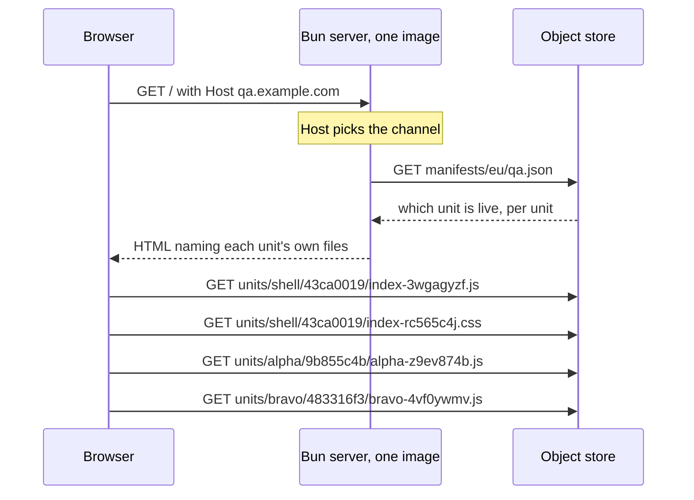

# pointer-deploy

A Preact single-page app whose server holds none of its files.
Deploying it writes one JSON file.

Live: <https://pointer-deploy.fly.dev/>

## What this demonstrates

A normal single-page app pipeline treats the app and the thing that serves it as
one artefact. Change a button label and you build a container image, push it to
a registry, and roll out new machines. Rolling back means doing all of that
again with an older commit.

They do not have to be one artefact. The server can do routing and templating
only, and read which version of the app to serve, per request, from a file.

| On every app change | Normal pipeline | Here |
| --- | --- | --- |
| Build the app | yes | yes |
| Build a container image | yes | no |
| Push it to a registry | yes | no |
| Restart or replace machines | yes | no |
| Change what visitors get | the rollout | one JSON write |
| Roll back | redeploy an older image | write the older JSON back |
| A preview environment | a whole stack | one more JSON file |
| Ship one panel of the page | the whole page ships | one field in that JSON |

So a deploy is this, and nothing else:

```sh
bun run promote qa --app alpha=9b855c4b
```

That moves alpha. The shell and the other three sub-apps stay exactly where
they were, and rolling alpha back afterwards leaves alone whatever was deployed
in between.

### The page is five bundles that agree with each other

The shell owns the state — a name, a colour, and a map of namespaced counters.
Four sub-apps read and write it. Two appear on the counters view, two on the
totals view, and the second pair reads counters the first pair created without
the two pairs ever being on screen together.

Each sub-app is its own **unit**: its own bundle, its own stylesheet, its own id,
published and promoted on its own and fetched when its view first needs it. That
is in tension with sharing state: a sub-app carrying its own Preact would have
its own signals runtime, and the shell's counters would silently stop
re-rendering it. So exactly one thing is shared, and the manifest carries it:

| | How |
| --- | --- |
| Shell, store, and one entry per shared specifier | One `Bun.build` with splitting, so Preact lands in a single chunk every entry reaches |
| Each sub-app | Its own `Bun.build` with those specifiers `external` |
| Joining them up | The manifest's `imports` becomes the page's import map |

`build.ts` refuses a sub-app that imports anything the import map does not name,
or that stopped importing `preact/jsx-runtime` by name. Either means it bundled
its own copy. `@pointer/shell` is no longer in the allowed set at all: a sub-app
receives the store as a prop, so a runtime import of that module could only be a
call to `createStore()`, which would render the sub-app against a store nobody
else on the page can see.

That this matters was measured, not assumed. Bundling Preact into each app turned
4 of the 6 browser scenarios red when it was tried.

### A sub-app is a component, and is handed the store

A sub-app default-exports a Preact component taking one prop. It does not export
`mount(el)` and it does not import the store. Both of those were changed for
reasons that were measured rather than argued:

| | |
| --- | --- |
| `mount(el)` called `render()` into a host node, giving each sub-app its own Preact root | An error boundary in the shell caught NOTHING a sub-app threw on a later render - the error reached `window.onerror`. Rendered as a child of the shell's tree, the same boundary catches it |
| A separate root also has no parent context | Preact context travels down the vnode tree, so a Provider in the shell reached nothing inside a sub-app |
| The store was a module-level export | A module-level singleton cannot be substituted. `createStore()` makes one, the shell provides it through context, and a test passes its own |

The contract carries no signal types. Every accessor on `ShellStore` reads a
signal's `.value` inside itself, which subscribes whichever component is
rendering, so `@preact/signals` stays out of the hashed surface entirely.
`ComponentType`, in `subapp.ts`, is the one vendor type the contract references -
and it is REFERENCED rather than inlined, so the hash does not yet cover what
Preact means by it. That hole is named in the TODO under §9.

### What happens on a request



The server never holds a script or a stylesheet. It is asked which units are
live, and it writes an HTML page pointing at each of them. Promoting a different
unit changes one answer to that question, so the next visitor gets a different
app from the same running machine — and only the part that moved is different.

Note the last two lines. Alpha and bravo come from different directories,
written at different times. **One `assetBase` per unit is the whole feature.**
Schema 2 had one base for the entire page, so every file had to come from one
build directory, which is what made the five bundles deploy and roll back
together.

### What it costs

| | |
| --- | --- |
| A visitor waits for a manifest read | No. It is cached 10 s and served stale while it refreshes |
| A deploy is instant | No. 7.1 – 10.2 s measured, because two caches sit in front of it |
| The store is on the critical path | Only for a cold start. A running server survives an outage on its last good answer |
| Old units can be deleted | No. A tab opened before the deploy still fetches its own files |
| A unit can be composed with any other | No. `promote` refuses a sub-app that needs a member this shell does not have |
| Anyone who can write the JSON | can serve an older composition, or break the page. Running their own code on the origin is closed: see below |

### Compared with

`../ajt-web-app-experiment` is the same app deployed the usual way: ArgoCD to six
clusters, six complete copies of the Kubernetes object set, roughly 79% of the
lines repeated, and a new image for every commit.

## Deploying

```sh
bun run build                                 # five units into dist/units/
bun run publish                               # uploads only what changed. Affects nobody
bun run promote qa --app alpha=9b855c4b       # the deploy
bun run promote qa --app alpha=36226fb9       # the rollback. Same command
bun run promote qa --shell 43ca0019           # the shell alone
bun run promote qa --from-build               # everything just built
```

`fly deploy` is not in that list, and `deploying-by-pointer.feature` asserts it:
the machine ids and their `updated_at` timestamps are identical before and after
a promotion. The image is rebuilt when the *server* changes, which is a
different and much rarer event.

`publish` writes each unit's `unit.json` **last**, after every file it names is
readable. `promote` refuses any unit with no `unit.json`, so a channel cannot
point at a half-uploaded unit.

`promote` reads the channel's current composition, applies only what you named,
and writes the result. That merge is the feature: without it every promote
replaces all five units, and "deploy alpha" silently rolls the other four back
to whatever the operator last had on disk. `falsify.ts` breaks the merge and
requires a scenario to go red.

### A unit id is a hash of that unit's output, and nothing else

The commit is deliberately not in it. It used to be — `<source>-<content>` — and
under per-unit publishing that is wrong: one commit touching only alpha would
change all five ids and republish all five, which removes the point. The commit
identifies the source, not the artefact, so it lives in `unit.json` as
provenance and reaches the served page in the `__BUILD__` block.

The consequence is that publishing is idempotent per unit:

```
$ bun run publish
  shell   43ca0019  unchanged
  alpha   9b855c4b  uploaded 3 files
  bravo   483316f3  unchanged
  charlie 8511a387  unchanged
  delta   d728f064  unchanged
```

## What stops a rollback breaking the page

Composing units means composing combinations that nothing has ever typechecked.
`tsc --noEmit` at HEAD proves the HEAD combination; rolling one unit back is
precisely how you get one it never saw. A shell that renamed an export, put in
front of a six-week-old alpha, is a page where one panel renders an error.

So each unit declares **which contracts it compiles against**, and `promote`
refuses a composition whose sets do not intersect. That was the whole rule until
2026-08-29; it is now the FALLBACK, and **Compatible, not identical** below says
what replaced it and why.

A contract is the type surface a sub-app is built against — `@pointer/shell`
and `SubApp` — and **its identity is the content hash of that surface**, never a
number. A number is a claim somebody has to remember to raise, and nothing stops
an edit to a published contract from silently breaking every unit that claimed
the old one. A hash is derived, so that edit produces a different identity
instead, which no unit claims, and the composition falls back to the contract
they do share. `verifyRegistry` re-derives every stored hash from its own files
and refuses a mismatch.

Support is a **set**, not a range or a floor. A set can say "supports the one
from June and the one from August, not the one in between", which is what
support genuinely is.

The sets are generated, never written:

```
$ bun run contract:matrix
         9e79879  571be5c
shell       fail     pass
alpha       pass     fail
bravo       pass     fail
charlie     pass     fail
delta       pass     fail
```

That is one `tsc` per cell, with `@pointer/shell` and `@pointer/subapp`
re-pointed at that contract's `.d.ts` files — the same `paths` mechanism
`tsconfig.json` already uses to point them at the sources. Two adapter files
carry the halves the call sites cannot prove on their own:
`src/web/shell/contract.ts` (the shell provides at least the contract) and
`src/web/apps/<name>/contract.ts` (the app provides `mount`).

Three consequences, and they are why the matrix is worth its cost:

| | |
| --- | --- |
| Nobody can claim a contract they did not compile against | The set is generated output. There is no hand-written claim to get wrong, so it stops being a thing to test and becomes a property |
| An additive change costs nothing | Every adapter still compiles against the new hash, so it joins every set with no new file and no decision. Adding an export to `api.ts` does not force four republishes |
| A breaking change appears as a `fail` column | In the unit that has to move, immediately, rather than in a browser weeks later |

The table above is the real output of making `increment(ns, by = 1)` require
`by`. The shell stops satisfying the old contract; the four apps, which all call
`increment(NS)` with one argument, stop satisfying the new one; the intersection
is empty. Every one of them calls `increment`, so the member gate below refuses
it too — this is a change that genuinely breaks all four.

`build.ts` refuses to run when the surface at HEAD hashes to something the
registry does not hold, and names the command:

```sh
bun run contract:mint --name counters-2026-08
```

The directory name is for people reading a listing. The hash is the identity.

### Which way did it change?

The hash says a surface changed and says nothing about the direction, and the
direction is the whole difference between a mint and four republishes. `tsc`
answers it, out of the machinery the matrix already has: two generated probes,
compiled the way `cell()` compiles a matrix cell, between the new surface and
each retained contract.

| Half | Who consumes it | The probe |
| --- | --- | --- |
| `shell.d.ts` | sub-apps | `const provides: typeof import("old/shell") = <the new module>` |
| `subapp.d.ts` | the shell | `const accepted: New.SubApp = <an old SubApp>` |

The direction reverses between them because a sub-app **consumes** the shell API
and **produces** a `SubApp`. Both compile: additive. Either fails, and
`contract:mint` says which half broke and for whom — here, `reset` taken off
`ShellStore`:

```
$ bun run contract:mint --name scratch-breaking
minted 4cdfc87 as contracts/scratch-breaking/

e0160a6 injected-store-2026-08: NOT additive.
  the shell half. The new surface no longer provides what this contract declared, so every sub-app published against it consumes something that is gone:
    probe/shell.ts(4,14): error TS2322: Type 'typeof import("new/shell")' is not assignable to type 'typeof import("old/shell")'.
      The types returned by 'createStore(...)' are incompatible between these types.
        Property 'reset' is missing in type 'import("new/shell").ShellStore' but required in type 'import("old/shell").ShellStore'.
```

A **warning, and never a refusal.** A breaking change is a legitimate thing to
mint — the shell split was one — and `promote` refusing a composition whose sets
do not intersect is what stops it reaching a channel. The reading is taken at
`contract:mint` and nowhere else: that is the moment a surface change is
recorded, and `build.ts` already refuses a surface no contract names.

Measured on 2026-08-28, against generated pairs of surfaces and against the two
contracts this repository has actually published:

| Change | shell half | sub-app half |
| --- | --- | --- |
| nothing | pass | pass |
| an export added | pass | pass |
| a second prop on `SubAppProps` | pass | pass |
| an export removed | `TS2741` | pass |
| a parameter narrowed | `TS2322` | pass |
| a required member added to `SubApp` | pass | `TS2322` |
| a type export renamed | pass | `TS2305` |
| `9e79879` → `e0160a6`, the change this repository made | `TS2740` | `TS2322` |

Two traps. The first was predicted and reproduced; the second was not seen
until the probes were run:

**A module-level probe reads the sub-app half as additive whatever happens.**
`subapp.d.ts` exports a type and no value, so `typeof import(...)` is an empty
shape and every `SubApp` satisfies it — including one that gained a required
member. The sub-app half names the **type**, never the module.

**`skipLibCheck` hides the type-only half of the surface.** A module shape
carries values, so with it on a removed or renamed *type* export left both
probes green: the resulting `TS2305` lands inside a `.d.ts` and is skipped, and
both `SubApp`s degrade to something permissive. The probes turn it off, which is
what the `TS2305` row above is; on this project it raises no error from
`node_modules` and takes a comparison from about 0.3 s to about 1.2 s. They also
load no ambient package (`types: []`), because with `skipLibCheck` off, loading
one means checking it.

`@pointer/shell` resolves to the **new** `shell.d.ts` in both probes, so the old
`subapp.d.ts` sees the store the shell would really hand it. One consequence to
know when reading the output: a type the new surface no longer names is reported
against the sub-app half, because `subapp.d.ts` is the file that imports it.

### Compatible, not identical

The hash asks whether two units were built against the **same** surface. The
question an operator actually has is different — does this sub-app need
anything this shell does not have — and the two come apart the moment the shell
drops a member nothing in the composition ever called.

`bun run contract:members`, on this repository:

```
member                alpha   bravo   charlie delta
ShellStore.countOf    uses    uses    uses    uses
ShellStore.increment  uses    uses    uses    uses
ShellStore.register   uses    uses    uses    uses
ShellStore.reset              uses
ShellStore.setColour
ShellStore.setName
ShellStore.snapshot                   uses    uses
ShellStore.user       uses    uses    uses    uses
User.colour           uses    uses    uses    uses
User.name             uses    uses    uses    uses
createStore

not removable on their own: Counts, ShellStore, User
```

Two of `ShellStore`'s eight members are called by no sub-app. Under the set
intersection, removing either refused every composition — because a **published**
app's contract set was fixed at its build time and cannot name a contract minted
after it. `createStore` is used by nothing either: the shell reaches `api.ts` by
relative path, so only the four apps are asked.

**Use is measured by removal, never parsed.** Cut one declaration out of the
surface and recompile the consumers against the rest; if it still compiles, they
do not use it. That is the same definition the rule needs, and `tsc` is the
oracle for it — the trick `falsify` plays on the scenarios, played on a type
surface. Two runs per member, one to prove the cut surface still holds and one
for all four apps at once: 11 members in about 4.3 s, in `build.ts` beside the
matrix. A member whose removal stops the surface being a surface — `ShellStore`
itself — cannot be asked about, and is reported rather than counted.

`unit.json` carries what was derived: `provides` on the shell, `uses` on each
app, both member path to the digest of that member's own declaration. The gate
is set inclusion with matching digests, so `promote` needs no compiler.

| Change to the shell | Set intersection | Member gate |
| --- | --- | --- |
| a member added | allowed | allowed |
| a member removed that no app uses | **refused** | allowed |
| `reset` removed | refused | refused, naming bravo and `ShellStore.reset` |
| a parameter narrowed | refused for all four | refused for the apps that use that member |

The digest is what keeps the same-name signature change covered; a list of
member *names* would call a narrowed `increment` the same member.

**The other half is gated whole.** `uses` reads `shell.d.ts`, which a sub-app
consumes part of. `subapp.d.ts` is what a sub-app *produces* and the shell
requires all of it, so each unit also records `subapps` — the sub-app halves of
the contracts it compiles against — and those must intersect. Contracts that
differ only in `api.ts` collapse to one entry there, which is exactly the churn
this exists to stop counting.

**The fallback stays, and it is why a rollback still works.** A unit published
before any of this carries no reading. A pair where either side lacks one is
judged on the contract sets, exactly as before. `promote` and the switcher call
one function, so an option the `select` greys out is one the promote would have
refused.

**Proved end to end** on 2026-08-29, `bun run e2e:members`, against the real
store and the real scripts: `reset` removed from `ShellStore`, the shell
published alone, and the four sub-apps left exactly as they were.

```
bravo uses ShellStore.reset, which this shell does not have. Nothing was changed.
  shell   0523e568  10 members provided
  alpha   e34063ba  6 members used
  bravo   38a212eb  7 members used
  charlie 47c478c4  7 members used
  delta   a8a66562  7 members used
```

Sixteen checks, all green. The contract sets in that run were `4cdfc87` for the
shell and `e0160a6` for alpha — disjoint, so the rule this replaced refused
alpha, charlie and delta too, none of which had ever called `reset`. Publishing
the rebuilt bravo made the same promote succeed, and `test-qa` came back to its
baseline.

Five `falsify` mutations cover the new rule, and writing them found two faults
in the checks rather than in the code. A scenario asserted only the member's
*name*, which both halves of the gate print, so disabling one half left the
other satisfying it. And `"if (refusal !== null) {"` matched `sourceRefusal`'s
branch as well as the gate, so the mutation patched the wrong `if` and was
reported as caught. **`falsify` now refuses a `find` that matches more than one
place** — the general form of the second fault, and the one that would have
hidden it.

### The other surface: the server and the shell

The contract covers `api.ts` and `subapp.ts` — the shell's surface with its
**sub-apps**. Its surface with the **server** is three JSON blocks in the
document, `__BUILD__`, `__APPS__` and `__VERSIONS__`, and nothing covered it:
the server is not a unit, so `promote` had nowhere to look.

**Demonstrated on 2026-08-28, not hypothetically.** Renaming `deployed` to
`live` in `__VERSIONS__` broke shell `606c1c3c`, which the switcher itself
offers. It went on reading `deployed`, got `undefined`, and pinned the query
parameter where it should have cleared it. The page rendered, the composition
worked, and the control quietly did the wrong thing.

**Why it could happen, counted on 2026-08-29:** each block's shape was declared
**twice**, once on the writing side and once on the reading side, and nothing
compared the two — `AppAssets` in `html.ts` and in `loader.ts`, `VersionOption`
in `composition.ts` and in `versions.ts`, `BuildInfo` in `html.ts` and
`ShellBuildInfo` in the harness. Three blocks, six declarations, no two of them
checked against each other.

**One declaration each**, in `src/server/blocks.ts`, reached by
`@pointer/blocks` the way the contract halves are reached. A renamed field is
now a compile error on whichever side did not move. It lives under `src/server`
because the runtime image copies that directory and nothing else; every import
of it is type-only, so nothing resolves the specifier at runtime.

**That holds only while both sides compile together**, and they do not. A shell
is a published unit a visitor can roll back to; the server is an image deployed
by `fly deploy`. So the same removal probe §9 uses runs on this surface — cut
one field, recompile the shell, see whether it still builds:

```
19 members written by the server, 10 read by this shell
never read: BuildInfo and all seven of its fields, VersionOption.deployed
```

`BuildInfo` is read by the harness and by a person, never by the shell bundle.
And **`VersionOption.deployed` is read by no current shell** — it is retained
for `606c1c3c`, and the reading now says so where a comment used to.

The reading travels differently from the contract's, because the party on the
other side is not a unit:

| Side | How it carries what it knows |
| --- | --- |
| the server | `bun run blocks:record` derives it and commits `src/server/blocks.provides.json`; `build.ts` refuses a stale copy. The image has no `tsc` to work it out at startup |
| the shell | `unit.json` records the fields it reads, like `uses` |
| the comparison | made by the RUNNING server. `promote` executes in a working tree and cannot see which image is answering requests |

| Situation | What happens |
| --- | --- |
| a chosen shell reads a field this server does not write | 400, and the option was already `disabled` in the `select` |
| the channel's own pointer names such a shell | served, with `x-shell-blocks` naming the field |
| a shell that records nothing | judged by nothing, and offered. The append-only rule is all that protects it |

The middle row is a decision: refusing a channel's own pointer would take the
site down over a control that misbehaves, which is worse than the bug. It is
reported in the same idiom as `x-manifest-age` beside it.

**Two @live scenarios and four mutations cover it**, and writing them found
three more fixture faults. *Choosing a shell this server cannot feed is refused*
passed with the gate disabled, twice for different reasons: its fixture also
shared no contract, so the older rule refused it; and it asked for the shell
before the origin's history had caught up, so the refusal was *not one this
channel has served*. The fixture now inherits the served shell's contracts and
members, and the step waits for the id to be known. Making it inherit then broke
the older scenario in the other direction — the contract-fallback fixture came
to carry a member reading, and the member gate allowed it — so a fixture can now
say it records **none**. Four fixture faults across this session, three found by
a mutation and one by a live run.

**What it costs:** about 10.5 s of `tsc` in every build, for the contract's 11
members and the blocks' 19 read together. The lane count is not what to tune —
at 12 cores the CPU sits at 1055% either way — the number of members is.

### What the contract does not cover

| Limit | Why |
| --- | --- |
| A same-name signature change | Covered. This is the case a list of exported *names* would have missed, and hashing the declaration surface catches it |
| A Preact major that breaks an old bundle | **Not covered.** Vendor types resolve from `node_modules` at HEAD, so a cell testing an old app against an old contract compiles against head Preact anyway — the vendor half would be identity with no verification behind it. Folding versions into the hash would instead force all four apps to republish on every patch bump. `unit.json` records the resolved versions and `promote` **warns** on a major mismatch |
| A change in behaviour behind an unchanged type | Not covered, and not coverable this way |

Measured, on this repository: the surface hash is stable across runs, unchanged
by a reworded and reflowed comment, and changed by `increment(ns, by = 1)`
becoming `increment(ns, by: number)`. Normalisation is `tsc
--emitDeclarationOnly --removeComments`, which is weaker than an API report
would give; a reformat that survives that would mint a contract everything still
supports, which costs one registry entry and no false refusal.

### The third surface: a service with no compiler behind it

The two surfaces above have `tsc` for an oracle. Both halves are built from
this repository at one commit, so a mismatch is a build failure and the matrix
can enumerate every pair. `pointer-deploy-api` is not like that. It is a
separate app with its own `fly deploy`, its surface is not a TypeScript file,
and what it returns this afternoon is a fact about the running world.

Three things replace the compiler.

| | |
| --- | --- |
| A shape checked at the boundary | `src/web/shell/service.ts` declares the response types and never imports them from `api/`. Importing them would put the compiler back in the loop and prove nothing: the shell would agree with the service's source at this commit, and the question is what the service sends |
| A version set compared at serve time | The shell records `api: ["v1"]`, the service publishes `GET /versions`, and the running server intersects them |
| A page that never waits | The store has defaults, the shell renders from them, and `hydrate()` fills in what the service holds afterwards. A service that is slow, unreachable or gone costs a DIFFERENT page, never a blank one |

The comparison happens in the SERVER and not in `promote`, for §11's reason one
step further out: a promote runs in a working tree and cannot see which service
is deployed. `x-shell-api` reports it — `ok`, the version named, or `unread`
for the three states nothing can decide (a shell published before this existed,
a server with no service configured, a discovery document not yet read).

A version set is coarse, and deliberately so: there is no declaration to take a
digest of. What the member gate does for `ShellStore` cannot be done here, and
saying that is better than pretending otherwise.

**Which versions a deploy answers is `API_SERVES` in its environment**, not a
constant in its source. Dropping v1 is a thing an operator does on a Tuesday,
to shells published long before that Tuesday. The routes are gated on the same
list, so the discovery document cannot claim one thing while the service
answers another.

`bun run e2e:api` proves it against the real store and the deployed service:
two shells promoted to `test-qa`, then `API_SERVES` moved to v2 with no unit
rebuilt and no image deployed. 12 checks, and the two that matter most are that
a visitor still receives the page and that only an OVERRIDE is refused. A gate
that refused the channel's own pointer would take the site down over a fourth
deploy, which is worse than the fault it would be reporting.

## Measured

| | Value |
| --- | --- |
| Promotion to every visitor seeing it | 4.7 – 10.2 s across eight runs, against a 15 s window |
| Propagation window by construction | 15 s: 5 s Tigris pointer cache + 10 s server cache |
| First request to a fully stopped machine | 4.59 s (wake, boot, cold manifest read) |
| First request to a running machine | 0.32 s |
| Runtime image | 40 MB, no `node_modules`, no `dist/` |

The 4.59 s is a `fly machine stop`, which is the worst case. `auto_stop_machines
= "suspend"` should wake faster; that was not measured.

## Layout

| Path | What it is |
| --- | --- |
| `src/server/origins.ts` | `Host` → channel, `FLY_REGION` → region, and the list of regions there are. Pure |
| `scripts/regions.ts` | Which regions a promote writes, when two of them disagree, and every manifest key a reader has to look at |
| `src/server/manifest.ts` | Cached fetch: 10 s TTL, stale-while-revalidate, single-flight |
| `src/server/html.ts` | The shell template |
| `src/server/index.ts` | Three routes and nothing else |
| `src/web/shell/` | The frame: the store factory (`api.ts`), routing, the context, and `AsyncAppLoader` |
| `src/web/shell/views.ts` | Which sub-apps appear on which route. The shell owns placement; `build.ts` checks it against the units it emits |
| `src/web/shell/AsyncAppLoader.tsx` | Fetches one sub-app and renders it INSIDE this tree, with the boundary that can therefore catch what it throws |
| `src/web/apps/<name>/` | One sub-app. Its own bundle, its own stylesheet, shares nothing with the others |
| `src/web/shell/subapp.ts` | `SubApp` and `SubAppProps`, the half of the contract a sub-app satisfies |
| `src/web/shell/contract.ts` | The shell's conformance, in one file the matrix can compile |
| `src/web/apps/<name>/contract.ts` | That app's default export, checked against `SubApp` |
| `src/web/vendor/` | One re-export per shared specifier. These are what the import map points at |
| `contracts/<name>/` | One retained contract: `shell.d.ts`, `subapp.d.ts`, and the hash of the two |
| `build.ts` | Five `Bun.build`s → `dist/units/<name>/`, plus the contract matrix. Records `dist/build.json` |
| `scripts/contract.ts` | Surface emit, the hash, the registry, the matrix, and the direction reading |
| `scripts/members.ts` | The removal prober: what a surface provides, and which member each consumer uses |
| `src/server/blocks.ts` | The server-to-shell surface: `__BUILD__`, `__APPS__` and `__VERSIONS__`, declared once |
| `src/server/blocks.provides.json` | What this server writes, derived and committed. The image cannot work it out |
| `scripts/e2e-member-gate.ts` | Drops a member and proves the refusal names one sub-app, against the real store |
| `scripts/store.ts` | SigV4 by hand: Bun's `S3Client` cannot set `Cache-Control` |
| `scripts/publish.ts` | `dist/units/<n>/` → `units/<n>/<id>/`. `unit.json` last, and only what changed |
| `scripts/promote.ts` | Read the composition, merge what was named, test the member gate, write |
| `scripts/e2e-independent-deploy.ts` | The three behaviours, end to end, read off the rendered page |
| `features/support/world.ts` | The harness: local stub vs live store, and the suite's own channels. The world, and nothing that registers with the runner |
| `features/support/bdd.ts` | The bindings, and the one file that names the runner |
| `features/support/hooks.ts` | Every hook, in the order they must run |
| `playwright.config.ts` | The runner: one worker, traces and screenshots on failure |
| `scripts/setup-store.ts` | One-off bucket CORS. See below |
| `scripts/publish-schema-2-fixture.ts` | One-off. The kept schema 2 manifest a rollback scenario points a channel at |
| `features/support/fixtures/schema-2.json` | That manifest, committed. Nothing rebuilds it |
| `scripts/falsify.ts` | Breaks the server and the deploy scripts 76 ways; each break must turn one check red, and a `find` that names more than one place is refused |
| `scripts/measure-preload.ts` | What warming a sub-app's files buys, in a real Chrome, with a control |
| `scripts/sweep-superseded.ts` | Lists, and with `--delete` removes, what no channel can serve and the retention floor allows |
| `scripts/retention.ts` | The floor itself: how long a superseded build is kept, decided against a clock the caller passes in |
| `stryker.config.json` | Mutation testing over the server logic |
| `features/` | The specification and the acceptance suite, in one artefact |
| `TODO.md` | Open items and what is done. Read it first after a context clear |

## Who decides where a sub-app appears

The shell. That was already true and had never been written down, which is how
the layout came to be written down twice — once in `Shell.tsx` and once in the
step definitions, with nothing tying the copies together.

`scripts/contract.ts` names the units, `build.ts` emits what that names, and
`src/web/shell/views.ts` decides which of them appear, on which route, in what
order. **The manifest names bundles and chooses nothing.** Two consequences
follow and both are accepted as the price of that answer: a layout change is a
shell publish and a promote, so alpha cannot be moved from `/` to `/totals` by
pointing a channel somewhere else; and rolling the shell back rolls the layout
back with it, because they are one unit.

`views.ts` is imported by the shell, by `build.ts` and by the step definitions,
so it holds no CSS, no JSX and nothing only a browser provides. `build.ts`
refuses a build where the two disagree:

```
the shell's views and the units this build emits do not agree:
  charlie is built and published, and no view places it, so nothing ever fetches it
```

Both directions, and only one of them ever reported itself. An app a view places
that nothing builds is caught at runtime by `AsyncAppLoader`, which says the
manifest names no bundle for it. An app the build emits that no view places is
published, promoted, paid for and fetched **never**, and nothing anywhere says
so.

The check runs in `build.ts` rather than in the suite on purpose: the pair that
has to agree is the published shell and the published manifest, and a check in
the suite compares two copies in one working tree. Importing `VIEWS` into the
step definitions removes that drift; it does not tie the harness to the
*deployed* shell, which may place apps differently, and that is a smaller claim
than it looks.

Not covered, and asserted so nobody mistakes it for coverage: the **route**.
Moving charlie from `/totals` to `/` leaves both sets identical.

## Warming a sub-app's files before its view is opened

A sub-app's bundle is fetched when its view first appears, so moving from `/` to
`/totals` used to wait on a network fetch that could have happened while the
visitor was reading the first view. The shell now emits a hint per file:
`<link rel="modulepreload">` per app script, `<link rel="preload" as="style">`
per stylesheet, from `appUrls(served)` and `moduleIntegrity(served)`.

**From `served`, and never from the channel's manifest.** A page composed by the
version switcher is serving an overridden unit, and preloading the channel's
copy would warm a file that page will not fetch.

**A hint and never a background `import()`.** An import EVALUATES the module, so
a sub-app the visitor never opens would have its top-level code run — and when
that runs is a behaviour a sub-app can notice. A preload fills the HTTP cache
and does nothing else.

Four things had to be checked and none of them assumed. `bun run measure:preload`
is the check: it runs the server from this tree against the real store, drives a
real Chrome, and then repeats itself with the tags removed as a control.

| | Reading |
| --- | --- |
| The policy | No refusal. `script-src` and `style-src` are already derived from the origins the manifest names, so neither hint needs a policy change |
| The digest | Each off-screen bundle and stylesheet is fetched **once** across the navigation. The import reuses the preloaded response rather than fetching a second time |
| The composition | The URLs follow the override, held by a unit test that composes one and asserts the preload moved with it |
| The cost | Four modulepreload and four style preload tags per load. Over doing nothing, that is the other view's two bundles and two stylesheets for a visitor who never navigates |

`loader.ts` needed no change: `addStylesheet` and the `loading` map still run at
mount, and a preload only warms the cache.

**A scenario was written for this, measured, and deleted.** "Opening a view
costs no further request for its bundles" is green with the preload tags and
green without them: the control shows the count after the navigation is 1 either
way, because with no preload the import does the one fetch itself. It
discriminated nothing. The question needs a control, and a control is a thing a
script can have and a scenario cannot — so it lives in `measure-preload.ts`.
What stayed in the suite is the reading the control does move: the bundles for a
view nobody has opened have been fetched, and no sub-app on that view has run.

## Two failure rules, on purpose

`origins.ts` fails **closed** on an unrecognised `Host` — host parsing is the
only thing separating prod from qa, so an unknown host gets a 404 and never a
channel. It fails **open** on an unknown `FLY_REGION` — the machine is running
somewhere, and refusing all traffic is worse than one wrong region. The miss is
logged.

`/healthz` reads no manifest. If health depended on the store, a store outage
would make the platform kill machines that were serving visitors correctly.

## What the origin says about its manifest

Every shell carries two headers naming what it was assembled from.

| Header | Reading |
| --- | --- |
| `x-manifest-age` | milliseconds since the last SUCCESSFUL fetch, or `never`. Not clamped: a negative value means this machine's clock is behind the one that stamped the entry |
| `x-manifest-refresh` | `ok`, or what the last refresh failed with |

The fault they exist for has one shape and three causes, and nothing outside the
process could tell them apart: **the channel moved and this origin is still
serving the composition before it.** The page looks correct, every check is
green, and "the deploy has not arrived yet" reads exactly like "this origin
stopped reading the store".

| The origin says | What it means |
| --- | --- |
| age under the TTL, wrong composition | the store answered with the old document |
| age far above the TTL, refresh `ok` | the origin stopped refreshing |
| a named error | the refresh is failing, and the last good build is being kept |

Reading the second row cost a day. `manifest.ts` decides freshness with
`now() - checkedAt < ttlMs`, over a WALL clock. A wall clock moves backwards —
an NTP correction does it, and so does a machine resumed from a snapshot with
its clock behind. `auto_stop_machines = "suspend"` can arrange that here, though
it has never been seen to: left idle for 30 minutes the machine did not stop,
because `min_machines_running = 1` holds it up, and a manual suspend and resume
brought the clock back correct.
The subtraction is then negative, negative is smaller than any TTL, the entry
never expires, and the origin serves a superseded composition for as long as the
skew lasts with not one failed request to show for it. The guard is one
comparison; the reading is what makes it diagnosable next time.

`scripts/probe-resume-skew.ts` measures both, and suspends the machine to do it.

The second row had a second cause, and it was found by making the fetch hang
rather than by waiting for the fault. `refresh` awaits `doFetch` under
`AbortSignal.timeout`, and a fetch that does not honour its abort never settles:
`e.inflight` stays set, every later request finds a refresh already in flight,
takes the stale path and returns at once. The entry is then frozen for the life
of the process - and nothing failed, so `x-manifest-refresh` still reads `ok`.
`bounded` is the backstop: the whole attempt races a timer at twice the
timeout, 6 s deployed, after which it is abandoned and `lastError` names it.
Whether the live occurrence on 2026-08-28 had this cause is NOT established -
nothing recorded whether a refresh was in flight - so what is fixed is a
mechanism that produced exactly that reading.

## Choosing which build the page runs

An operator can run an older unit on a channel without promoting it, and see
what a rollback would serve before anybody else does.

```
https://qa.example.com/?alpha=36226fb9
```

The `select` is in the shell, one per unit. Choosing reloads with the id named
in the query string; choosing what the channel already serves removes the
parameter, so a link copied from the page keeps following the channel instead
of freezing at today's build.

One option is marked **live**, and the word is load-bearing. Every id in the
list has been deployed to that channel - being deployed is exactly what put it
there - so "deployed" would be true of all of them and would mark nothing. Only
one is what the pointer names now.

**Where the ids come from.** `promote` writes
`manifests/<region>/<channel>.history.json` beside the pointer, holding every
unit that channel has served, newest first, capped at 20 per unit. It is the
pointer's only writer, so the history has one writer too and cannot race a
`publish`. The id being served goes to the head, so the cap prunes from the tail
and can never take what is live. It is written BEFORE the pointer and is never
allowed to fail a promote: the pointer is the deploy, and an index of what a
switcher may offer must not hold one hostage.

The whole composed unit travels in it, and its contract set with it. The
alternative is a fetch per option and a second cache; this way the server needs
neither, and it can say which options are impossible.

**Two refusals, and the first is the one that matters.**

| Asked for | Answer |
| --- | --- |
| An id this channel has never served | 400. Without this the query string is a way to make the origin serve any object in the store |
| A sub-app needing a member that shell does not have | 400, and the option was already disabled in the `select` |

An option that cannot be composed is **disabled and not hidden**. "This build
exists and cannot run beside the others" is the reading an operator came for,
and hiding it would say the build was never deployed.

**On wherever there is something to choose between.** There is no flag. This
project exists to show the approach, and what a rollback would serve is a thing
to look at rather than a thing to be told about. Nothing about it is a way in:
an id the channel has never served is refused, and the shell is `no-store`, so
one visitor's choice reaches nobody else.

**It never costs a visitor a wait.** The history is read with `peek` and never
`get`. A cold manifest is worth waiting for, because without one there is no
page; a cold history is not, because without it the page is exactly the one that
was served before the switcher existed. The first request after a server starts
has no switcher and the next one does. `scripts/e2e-version-switcher.ts`
reloads once rather than reporting that as a fault — reproduced on 2026-08-28:
no switcher at all on the first request, five selects with two options each on
the next, against a machine that had been up and idle.

**One of that script's checks has three states, and §20 is why.** Whether the
chosen unit renders differently from the deployed one is a fact about the
channel's history and not about the code. On 2026-08-28 `qa` held two
generations of each sub-app, at `b2c8154` and `2c08a50`, and they differ by six
bytes — `register(NS)` moving from `useEffect` to `useLayoutEffect`. All four
sub-apps therefore rendered identically and the check went red for all four,
honestly and uselessly; a check that is usually red is a check people stop
reading. It now reports **UNDECIDED**, the way `falsify` reports a mutation
nobody ran rather than counting it as passing:

```
  ok   the page fetches alpha from the chosen unit's own directory
  ----  the chosen unit is a different bundle from the deployed one
        UNDECIDED: e34063ba and a3bba92a render the same text, so the page cannot say which one ran.
        The check above says the chosen unit's own file was fetched, so this is two
        generations that look alike. Publish a visible change and promote it to decide it.

SUCCESS: the switcher serves a chosen unit, and moves no channel doing it, 1 undecided on what this channel has published.
```

It stays a **FAILURE** when the check above it did not pass. That check — the
page fetched the chosen unit's own file — is what establishes which unit ran,
so without it an identical page is a switcher that ignored the choice. Measured
both ways on 2026-08-28: four sub-apps undecided and exit 0; the fetch check
forced red, and the same identical render exits 1.

**The blocks are a surface the contract does not cover, and renaming a field in
one proved it.** `__BUILD__`, `__APPS__` and `__VERSIONS__` are written by the
server and parsed by the shell. The contract hash covers `api.ts` and
`subapp.ts` - the surface between the shell and its SUB-APPS - and nothing
covers this one. Renaming `deployed` to `live` in `__VERSIONS__` broke shell
`606c1c3c`, which the switcher itself offers: it went on reading `deployed`, got
undefined, and pinned the query parameter where it should have cleared it. The
page rendered, the composition worked, and the control quietly did the wrong
thing. `promote` could not have refused it, because the server is not a unit.

The rule that follows, and the field is retained under it: **these blocks are
append-only.** A field may be added, and a field may stop being read. A field
may never be renamed or removed while a shell that reads it is still in a
channel's history.

**One dead end, and it is inherent.** The control lives in the shell, so
choosing a shell published before the switcher existed serves a page with no
control. The server still renders the options block - the older bundle simply
does not read it. The way back is to remove the query parameter. Nothing can fix
this from the server side: the code that draws the control is in the unit being
rolled back.

**What it cost, and what it did not.** The policy and the digests came free:
both are already derived from the manifest, and each unit carries its own
`assetBase` and `integrity`, so a composition assembled from a query string
needs no new code for either. That is schema 3 paying for itself.

What is NOT built is a `select` inside each sub-app. The shell draws all five,
which makes every unit selectable, but handing the data to a sub-app means
adding to `api.ts` or `subapp.ts` - and the contract hash is taken over exactly
those two files. One export there mints a new contract, and every unit has to be
rebuilt before it can claim the new one.

What that does **not** do was measured on 2026-08-28, against the claim this
paragraph used to make. An additive export does not force a republish and does
not make any id already in a channel's history unselectable: the shell goes on
compiling against the retained contract, each published unit keeps the set it
was built with, and the intersection stays non-empty.

| Change to `api.ts` | shell x the old contract | alpha x the old contract | Promote |
| --- | --- | --- | --- |
| baseline | pass | pass | allowed |
| one export ADDED | pass | pass | allowed |
| one export REMOVED | fail | pass | allowed since 2026-08-29, if alpha never called it |

That last row used to read *refused, correctly*, and it was neither. See
**Compatible, not identical**.

## Which compositions are being handed out

`GET /compositions` answers what this origin has served, in memory, since the
process started. It reads: no route accepts a write, and the server still
refuses every method that is not GET or HEAD.

```sh
curl -s https://pointer-deploy.fly.dev/compositions
```

| Field | Reading |
| --- | --- |
| `compositions[]` | one row per distinct composition, most recently served first: channel, region, the unit ids, and the contract it resolved at |
| `responses` | how many shells that row was handed out in |
| `overrides` | how many of those the query string composed, rather than the channel's pointer |
| `evicted` | rows dropped once `capacity` was reached. Non-zero means the list is partial |
| `since` | when this process started counting. Its own zero |
| `answers`, `blindTo` | what the number means, and the three things it does not cover |

**Why it exists.** Nothing can be REMOVED without it. A deprecation that names a
date is a guess; a deprecation that names traffic is a decision. Both this and
the `deprecated` field `TODO.md` §10 wants are the same half of one job, and
this is the half that answers "is anybody still being served it".

**Two readings, and only one is free.** What is handed OUT, the server already
knows: every response names its composition and the shell is `no-store`, so
every navigation reaches this origin and the count costs one map write. What is
still RUNNING, it cannot know - a tab opened before a promote keeps its
composition and never asks again, which is exactly the population a sunset has
to worry about. Only the page can say, and a beacon needs a route that accepts
a write plus a bucket write key on the production origin: the same key the CI
item refuses to give CI. So this is the free half, and it carries its own limits
in `blindTo` rather than leaving a reader to assume them.

| It does not answer | Why |
| --- | --- |
| what is still running in an open tab | that page never asks again, so this origin never hears from it |
| any other machine, or this one before it was replaced | the count is in memory. `min_machines_running = 1` holds one machine up; a replacement still starts at zero |
| what the cap dropped | `evicted` says how many, and nothing says which |

**An operator is not a visitor.** The version switcher composes a page from the
query string, and those responses are marked in `overrides`. Without the split,
one operator working through the switcher reads as visitors still being served
an old unit - which is the exact finding that would stop it being removed.
Measured live: the composition an override asked for had 3 responses and 1
override, because the promote in the same scenario had polled this origin while
the channel was still serving it.

**Checked against the running image, not only the code.** One `@live` scenario
in `features/counting-what-is-served.feature` loads the deployed origin and then
reads what it says it handed out. It was seen red before the deploy that shipped
the route, and the failure names why: an image that does not know a path renders
the SHELL for it, so `/compositions` answered `200 text/html` rather than 404.

**The cap is a bound, not tidiness.** The switcher refuses an id the channel has
never served, so the reachable set is bounded by the history depth per unit -
which is 20 to the power of the unit count, and anyone holding a link can walk
it. `SERVED_CAPACITY` is 200, and the map is re-inserted on every hit, so what
is dropped is always the least recently served. The composition a promote just
started handing out is the newest row and can never be the one dropped.

## Marking a contract as going away

A contract is retired in two steps, and the first one is a sentence somebody
writes down.

```sh
bun run contract:mint --name injected-store-2026-08          # the successor
bun run contract:deprecate --hash 9e79879 \
  --reason "the store is injected now" --instead e0160a6     # the predecessor
```

That writes a `deprecated` record - a reason, the date it was recorded, and the
contract to move to - onto the registry entry beside the hash.

**It is not in the hash, and it must not be.** A deprecation is decided long
after the mint. Folding it into the identity would move the hash under every
unit that already claimed it, which is the one thing a content hash exists to
prevent. So it sits on the record, and `verifyRegistry` checks its shape instead
of its bytes - every command that reads the registry applies that check, because
the field can also be written by hand.

**It warns and never refuses.** A deprecated contract is still the contract
published units were built against, so refusing it would make rolling back onto
them impossible - the operation this whole project exists for. Deprecating does
not un-retain either, for the same reason.

| Where | What is said |
| --- | --- |
| `bun run contract:matrix` | a line under the table: the reason, the date, what to move to, and that it is still retained |
| `bun run promote` | a `WARNING` when the composition resolved at it, naming the same three things |
| a promote with no other option | one more line. Every contract the composition shares is deprecated, so there is nothing to move to without rebuilding |

**Three states are refused rather than warned about**, because each one names a
move nobody can make:

| Refused | Why |
| --- | --- |
| deprecating the contract at HEAD | everything built from now on is built against it. Mint the successor first - that is what makes HEAD something else |
| `--instead` naming a contract that is not retained | nothing can be promoted against it |
| `--instead` naming a contract that is itself deprecated | a move that lands on a deprecation is not a move |

The first is checked twice: by `contract:deprecate` before it writes, and by
`contract:matrix` against the registry however it came to be that way.

**Lifting one is a hand edit** to `contracts/registry.json`, exactly as
retention already is. Deprecating is a decision, and so is changing your mind
about it; neither is something a script should do quietly.

**The half this does NOT do: a FIELD.** One hash covers the whole surface, so
there is no room in it for "this member is going away". `@deprecated` in a
docstring is the obvious carrier and `emitSurface` strips comments on purpose -
`removeComments: true`, so a docstring edit does not mint a contract. That is
right for the hash and wrong for the consumer, and deciding what carries it is
most of the work. What §9's member gate gives is the missing half of the
reading: `uses` already records which sub-app names which member, so when a
carrier is chosen, the consumers of a deprecated member can be listed rather
than guessed at.

**Proved by `bun run e2e:deprecation`**, against the real store. Nothing smaller
can produce the state: a deprecation on the contract at HEAD is refused, so
showing one needs a successor minted first, and the promote warning needs
published units whose contract set names the old one. So the artefact mints,
marks the predecessor, and reads what `contract:matrix` and `promote` actually
print - then restores `api.ts`, the registry and `test-qa`. The pure readings
underneath it are held by 16 unit tests and four `falsify` mutations.

## A second region

A machine reads exactly one region's manifest, chosen by its own `FLY_REGION`
through `resolveRegion`. So the question a second region asks is not "how are
the files copied" - they are not - but "what writes the other pointer".

| Per region | One copy, everywhere |
| --- | --- |
| `manifests/<region>/<channel>.json`, the pointer | every unit's files, reached by an absolute URL |
| `manifests/<region>/<channel>.history.json`, what the switcher offers | `units/<name>/<id>/unit.json`, the contract registry |

**One promote writes every region.** A promote that wrote one would leave the
other serving what it served before - correctly, from what that machine can see,
which is exactly why nothing else would catch it. `--region us` writes one
region on purpose, and that is the only way to make the regions differ.

**Two regions that already differ stop a promote.** The merge that makes "deploy
alpha, leave bravo where it was" possible reads ONE region, so writing both
would replace the other with a composition nobody chose for it. The refusal
names the units that differ and the flag that resolves it. A region with no
pointer at all is not a difference - it is what a first promote is for, and
refusing it would leave a new region reachable only by hand.

**The two writes are not one operation.** Two pointers are two objects, so
between them one region serves the new composition and the other the old. That
window is smaller than the `MANIFEST_TTL_MS` every machine already reads
through, and the alternative - one region ahead of another until somebody
notices - is the state the loop exists to prevent.

**The sweep reads every region, and this is not a detail.** A sweep that read
one region would see the other region's pointers and histories as naming
nothing, and would delete the units a machine there is serving. `manifestKeys`
in `scripts/regions.ts` is the one list both readers take, so a region this
server would resolve to and a region no sweep looks at cannot drift apart.

```sh
bun run promote qa --shell <id>              # every region
bun run promote qa --shell <id> --region us  # one region, deliberately
fly scale count 1 --region iad               # the machine that reads manifests/us
```

**The scenario that proves it had to compare documents, not ids.** "Every region
names build alpha" passed against a promote that wrote one region: the other was
already at alpha from an earlier run, because a build marker produces the same
unit ids every time. `falsify` is what found that - the mutation stayed green.
The scenario now reads the whole pointer from every region and requires the
bytes to match, `composedAt` included, which only one promote writing both can
produce.

**The machine, read from the machine.** Both regions hold the same composition,
so nothing on the page tells one machine from the other. What separates them is
which manifest each READ, and `/compositions` records that against every shell a
process hands out. Forced onto `8654506f5e9018` in `iad`: rows with
`region: "us"`. The ams machine: `eu`. The control matters as much - asking for
`Fly-Prefer-Region: syd`, where there is no machine, is answered from `ams` and
reports `eu`, so a region with no machine fails the scenario rather than passing
quietly.

Checked by four `@live` scenarios in `features/serving-from-two-regions.feature`
against the real store, the real script and the deployed machines, three
`falsify` mutations bound to the first three, and 12 unit tests over the two
readings. `manifests/us/qa.json` and
`manifests/us/prod.json` were bootstrapped on 2026-08-30 by promoting each
channel's current composition, which rewrote `eu` with the same bytes and
created `us`.

## How long a superseded build is kept

`bun run sweep` removes what no channel can serve. On its own that is a reading
about the STORE, and the thing at risk is a BROWSER: a tab opened before a
promote keeps its composition and fetches a sub-app's files the moment somebody
opens that view - minutes or days later, from a page nothing can reach to tell
it otherwise. So there is a floor, and two clocks feed it.

| The reading | What it catches |
| --- | --- |
| the object's own age | a unit published yesterday and superseded today is a day old, whatever a history says |
| when a channel stopped serving it | a unit published a year ago and served until yesterday is a day out of use |

Both must be past 90 days. The second is the one an age-since-publish rule gets
wrong, and the state where that bites is not exotic: un-retaining a contract
drops every history entry that named it, and the units behind them become
deletable in the same sweep.

**The second clock had to be written down first.** Nothing knew when a build
stopped being served, because only the promote that displaces it knows.
`promote` now stamps `supersededAt` on the entry it moves off the head, keeps
the stamp an entry already carries, and leaves the head unstamped - a rollback
puts an id back at the head and it is being served again. Measured on
`test-qa`, 2026-08-30: rolling `alpha` back stamped `e34063ba` at the second the
promote ran, and rolling forward again cleared it and stamped `d6c9f501`.

An entry written before the stamp existed counts as the last time that history
was written, which is the latest moment it could have stopped being served. The
first promote after this change freezes that inference onto the entry rather
than leaving it to be re-made every sweep.

**A history entry is dropped only for a unit that is actually deleted.** The
drop exists so the switcher cannot offer a build whose files are gone; dropping
one whose files stay would retire a build the floor is deliberately keeping.

```sh
bun run sweep                  # what it would remove, and what the floor holds
bun run sweep --floor-days 0   # the control: the rule without the floor
bun run sweep --delete         # irreversible
```

Measured against the real store on 2026-08-30, minutes after an e2e run
published and superseded five units:

| Floor | Objects it would remove | History entries dropped |
| --- | --- | --- |
| 90 days | 0 | 0 |
| 0 days | 459 | 3 |

Those 459 are the reason the floor exists rather than a number to tidy away: at
the moment of the reading every one of them had been serving traffic within the
hour. `legacy/` stays exempt and the sweep still refuses to run if anything
under it reaches the delete set.

## Verifying

```sh
bun test                   # 383 unit tests: src/server, src/web, scripts, features/support, ~20 s
bun run verify             # 29 @local scenarios, stub store, ~9 s
bun run contract:matrix    # 5 units x retained contracts, ~0.8 s
bun run contract:members   # which member of the surface each sub-app uses, ~4.3 s
bun run blocks:record      # what the server writes into its three JSON blocks, ~6.5 s
bun run verify:live        # 42 @live scenarios against Fly and Tigris, ~11 min
bun run verify:browser     # 18 @browser scenarios in a real Chrome, ~1 min
bun run falsify            # 76 architectural mutations, each must turn a check red
FALSIFY_LIVE=1 bun run falsify   # including the twenty-two that need the real store
bun run e2e                # deploy one app, deploy another, roll the first back
bun run e2e:members        # drop a member, and refuse only the app that used it
bun run e2e:deprecation    # mint a successor, mark the old contract, read what both commands say
bun run measure:preload    # what warming a sub-app's files buys, with a control
bun run scripts/e2e-version-switcher.ts   # drive the switcher on the LIVE site
bun run mutate             # Stryker over the server logic
```

`bun test` covers four homes. `src/server` is the server's pure logic,
`features/support` is the harness's own, `src/web` is where build-time code in
the web tree goes — `views.ts` decides which sub-apps the build must emit — and
`scripts` is the newest, and holds the three readings that cost real `tsc` runs:
`contract.test.ts` is §8's direction reading, `members.test.ts` is §9's removal
prober, and `blocks.test.ts` holds §11's committed reading to the surface it
came from.

### The runner

The `.feature` files are executed by **Playwright**, through `playwright-bdd`,
which generates one spec per feature. It replaced cucumber-js, and the features
did not change a line: `playwright-bdd` supports a cucumber-style world, so
`this` inside a step is still the `PointerWorld` and the Gherkin parameters are
still the arguments.

What it buys is what a failed browser scenario leaves behind. A trace and a
screenshot, retained on failure, instead of a line of text — which matters most
for the scenarios only a browser can check, because those are the ones whose
failure is hardest to reconstruct afterwards.

**It still runs on Bun, and the two ways of starting it are not the same.**
Measured, because the difference is invisible until the harness fails to
import itself:

| Command | The workers run under |
| --- | --- |
| `bun x playwright test` | **Node.** No `Bun` global, no `bun:test`, and `features/support/world.ts` cannot load |
| `bun node_modules/@playwright/test/cli.js test` | **Bun.** `process.versions.bun` is set and the harness loads |

The harness is Bun code — `Bun.spawn`, `Bun.serve`, `Bun.file`, `Bun.CryptoHasher`
— and it imports `scripts/store.ts` and `scripts/contract.ts`, which are the
same files `build`, `publish` and `promote` run. So the scripts name the runner
the long way, exactly as they already named cucumber's own bin.

Two things follow that are worth stating rather than discovering:

- **One worker, on purpose.** The live scenarios publish builds and promote them
  to two channels the suite shares, and `world.ts` keeps one module-level map of
  build name to unit ids. Two scenarios at once would race on the pointer and on
  that map, and the failure would read as propagation rather than as a race.
  Making `@local` parallel is possible — each of those starts its own stub store
  and its own server on port 0 — and it is a separate piece of work. So of the
  three things the port was expected to buy, traces and screenshots arrived and
  parallelism did not.
- **Tags are filtered at generation.** `bddgen test --tags @local` emits no
  `@browser` scenario, so a local run never asks for a `page` and never starts a
  browser. `playwright-bdd` collects the fixtures a generated FILE needs, so
  filtering afterwards would have started one anyway.

The port also found a defect in the deploy tripwire, and it is the kind worth
recording. Playwright reports a failed `beforeAll` against the first test of its
file and carries on with the other files; a dropped connection while reading the
baseline therefore left `AfterAll` comparing `undefined` against what the
channels served, and it printed *the live suite moved 2 real channels. That is
a deploy* — the most alarming sentence this suite can produce, about a run that
deployed nothing. A missing baseline is now its own message, the baseline is
taken by every live scenario's own `Before` rather than once, and
`pointerBuildId` retries a request that gets no answer.

An `@live` scenario about **server** behaviour cannot be falsified by a source
edit, because it runs against the deployed image. Two mutations that break
`html.ts` therefore point at unit tests instead, and `falsify.ts` says so at the
mutation. The three live ones that do work break `publish.ts` and `promote.ts`,
which run locally.

`bun run e2e` is the one that answers the question the feature was built for,
and it is the only one that can. The unit tests construct compositions by hand.
The `@live` scenarios read unit ids out of the served HTML, which is the
manifest talking about itself. `e2e` drives the documented commands and then
reads the **rendered DOM** — the marker each sub-app painted — because that is
the only place "alpha moved and bravo did not" is a fact about the application
rather than a fact about a JSON file. It writes only `test-*` channels.

One thing in it is not the deployed machine, and the script says so at the top.
`Host` is forbidden to `setExtraHTTPHeaders` and Fly routes on SNI, so no
browser can reach a `test-*` channel on Fly — the trap this README already
records, met again from the other side. So the browser half runs
`bun src/server/index.ts` locally against the real store, and `origins.ts`
carries `test-qa.localhost` for it, development only. Everything else is real,
and the machine fingerprint is compared before and after.

`@browser` uses the Chrome already on the machine — `channel: "chrome"` — so
nothing downloads a second browser. The page is the runner's, which is what
attaches a trace and a screenshot to a failure; the harness used to launch its
own, and a page it launched itself has neither. Nine of those eighteen scenarios cover what
nothing else can see: five separately published bundles agreeing about one
store. The rest cover the schema they would agree about after a long rollback,
what the page is allowed to load, what a panel that throws costs, and which
files are warmed before a view is opened — see below.

**Which composition a @browser scenario reads is the whole difference between
two that look the same.** Without `@test-channel` it loads the live address and
reads what is DEPLOYED, which is a check on the deploy and cannot be falsified
by an edit here. With `@test-channel` its Background builds and promotes from
this tree, so the browser loads the bundles this edit produced.
`shared-state.feature` carries the same two scenarios under both, as two Rules,
because each answers a question the other cannot. Measured, not argued: making
`user()` read `peek()` — the store still holds the name and subscribes nobody —
reddens the @test-channel copies and leaves the deployed copies green.

Two kinds of mutation testing, and they cover different things. **Stryker**
mutates operators and literals in the pure logic. It found a real gap: every entry in `FLY_TO_REGION`
returned `"eu"`, the same as the fallback, so deleting the lookup left every
test green. **`falsify.ts`** makes the architectural changes Stryker cannot
generate — removing single-flight, making the health check read the manifest,
unsharing the store. Neither replaces the other.

Measured on 2026-08-29, `bun run mutate`: 750 mutants, 750 killed, 0 survivors
across all five files - `composition.ts` 267, `manifest.ts` 264, `html.ts` 174,
`origins.ts` 42, `provides.ts` 3.

It reached that twice on one day. The first reading, taken while the member gate
and the blocks reading were new, was 757 mutants with 28 survivors: 23 in
`composition.ts`, 3 in `provides.ts` - a file with no test at all - and 2 in
`html.ts`. Five of the 28 were unreachable and are excluded in place; the other
23 were real gaps and cost 15 tests. What each one found is worth reading:

| The gap | What no test asserted |
| --- | --- |
| `provides.ts` had no test | What the running server judges every shell against. All three mutants made it read `{}`, which refuses nothing |
| a member gate that throws | An app entry with no reading was skipped by a guard nothing exercised, so removing the guard threw instead of falling back |
| which half refused | Both halves name the member, so `toContain` on the name passed when the wrong branch fired |
| the separator | `join("; ")` between two problems, invisible to a `toContain` of one |
| `some` against `every` | No fixture had a sub-app carrying two SubApp halves |
| a preload block | Six tests read one tag each with `toContain`; none could see an extra entry or the string joining them |

A survivor is one of three things, and only the first is chased:

| | |
| --- | --- |
| A real gap | Something the tests never asserted. Write the test |
| Wording | A log sentence, the default log sink, a request header the store does not negotiate on. A test that killed it would pin a choice nothing depends on |
| Unreachable | No input distinguishes the mutant from the original |

The second and third are excluded in place, with the reason on the line above
them, so the next reader gets the argument rather than the number. `manifest.ts`
has one of the third kind: a single-flight guard whose only caller cannot
violate the invariant it checks, kept because it states what a second call site
would have to keep.

Reaching 100% on `manifest.ts` changed the shape of its assertions, and that is
the transferable part. `toThrow("apps.alpha")` passes on ANY throw carrying that
text — including the TypeError from one line further in, which is exactly what a
deleted guard produces. The tests now assert the parser's own message, anchored,
naming the field: `^manifest field apps\.alpha `. The trailing space is what
pins the depth. Without it a failure one field deeper, at `apps.alpha.js`,
satisfies the same assertion, and a guard that stops rejecting malformed apps
passes.

Two tests were also green for the wrong reason. The non-2xx case sent a body
that could not parse, so the refresh failed on the body and the status check
could be deleted with nothing noticing; it now sends a VALID manifest with a 500.
And every timing test named its own `ttlMs` and `timeoutMs`, so the defaults a
server actually starts with were never run — a default timeout that is not a
number aborts every request before it is sent, and the store looks dead while
sitting there healthy.

The other two files gave up four gaps of their own:

| | |
| --- | --- |
| Attribute escaping | Nothing tested it. Whoever writes a manifest names the files, and a file name carrying a double quote leaves its attribute. The order matters too: the ampersand must be escaped first, or the one inside `&quot;` is escaped again |
| A digest pattern with no end anchor | A source map is named `index-a.js.map`. Matching `.js` anywhere in a name rather than at its end puts a digest on one, where the module loader never looks |
| An unsorted policy | The origins came out in manifest order, so the header's text depended on which unit was named first. A header nothing can compare against is a header nothing checks |
| Six of ten Fly regions | Untested, and the six mapping to `eu` cannot be told from the fallback by what they RETURN. What separates them is the warning: a mapped region is silent. That silence is the only signal the table is complete |

`@local` covers only what needs an injected failure — an unreachable store, a
corrupt manifest, a counted read. Everything that publishes or promotes is
`@live` against the real store, because a stub that reimplemented those could
pass while the real path was broken.

`falsify` exists because a check that has only ever been green is not evidence.
It found three that proved nothing:

- a "malformed manifest" case whose document was invalid JSON, so manifest
  validation could be deleted and no test noticed;
- a burst test whose 25 requests never overlapped, because the stub answered in
  1 ms;
- and that same burst test after it was made to overlap, which then went red on
  only two runs in five. How many times the server fetches is not observable to
  a visitor, and measuring it through the network measured Bun's connection
  pooling: with one response held open, later fetches queue on the pooled
  connection and never reach the store. The scenario is gone and the unit test,
  which counts an injected fetch directly, catches the same mutation six times
  in six.

## Two channels without a domain

Fly gives one free hostname per app, and `.fly.dev` is Fly's namespace, so a
second channel cannot have a resolvable name until a real domain points here.
Fly forwards the `Host` header to the app untouched, so the channel works today
for anything that can set one:

```sh
curl https://pointer-deploy.fly.dev/                                  # qa
curl -H "Host: prod.pointer-deploy.test" https://pointer-deploy.fly.dev/   # prod
```

Both are answered by one machine, and `channel-selection.feature` asserts that.
`.test` is IANA-reserved and never resolves, which keeps it obvious that no
browser reaches prod yet. A domain is needed for a browser-reachable prod URL,
not for the behaviour.

## The suite deploys, so it deploys somewhere else

`verify:live` publishes throwaway builds and promotes them, because a stub
standing in for `promote` could pass while the real promote path was broken.
Promoting is the deploy. Pointed at `qa` and `prod`, the suite therefore
deployed a scenario's build every time it ran, and the application served a
build marked `alpha` or `beta` until someone promoted a real one.

There are four channels now. Two the application is served from, two the suite
owns:

| Channel | Host | Written by |
| --- | --- | --- |
| `qa` | `pointer-deploy.fly.dev` | an operator |
| `prod` | `prod.pointer-deploy.test` | an operator |
| `test-qa` | `test-qa.pointer-deploy.test` | `verify:live` |
| `test-prod` | `test-prod.pointer-deploy.test` | `verify:live` |

The `.feature` files still say "qa" and "prod": which channels the harness uses
is not part of the specification, so `features/support/world.ts` maps them and
nothing else changes. Two checks stand behind the mapping — `world.promote`
refuses any live target not prefixed `test-`, and the run records what `qa` and
`prod` point at before the first scenario and fails if either moved by the end.
The second repairs nothing on purpose: a restore hook that fails leaves the
channel wrong and reports success.

Five of the eighteen `@browser` scenarios load `pointer-deploy.fly.dev`, so they
read the real `qa` channel — no browser can be made to send a `Host` header.
They write nothing. Promote a build to `qa` before running them, or they check
whatever was last deployed.

The twenty `@test-channel` scenarios do write, because what they are about is a
channel pointing somewhere no promote would put it. They take the same way out
`e2e` does — `bun src/server/index.ts` locally against the real store, reached
at `test-qa.localhost` — write `test-qa`, and put the exact bytes back
afterwards. `world.pointChannelAtDocument` refuses any channel not prefixed
`test-`, the same tripwire `promote` carries.

## The bug that only a browser found

The first deployment passed every check — unit tests, both suites, `curl`
returning correct HTML with the right asset URLs — and rendered a blank page.

The document and the bundle are on different origins by design. A cross-origin
`<script type="module">` is fetched in CORS mode, and Tigris sets no
`Access-Control-Allow-Origin` by default. The stylesheet loaded, because `<link>`
is not CORS-restricted, so the background painted and nothing else appeared.
`flyctl` has no CORS flag, so `scripts/setup-store.ts` sets it through the S3
API.

`publishing-a-build.feature` now carries a scenario for it. It was confirmed to
go red with the bucket restricted to another origin, and green again after.

## The bug the clean tree found

Build ids were the git short SHA. Publishing two builds from one commit — the
same source with different build-time configuration — gave both the same id.
The second overwrote the first and both channels served one bundle. Without
`--force` the second would instead have been refused as already published,
which is equally wrong.

An id names an artefact, and the commit does not identify the artefact. It became
`<source>-<content>`, and then, when publishing moved to units, `<content>`
alone: keeping the commit in a *unit* id meant one commit touching only alpha
changed all five ids and republished all five. The same argument, taken one step
further than it was the first time. The suite refuses two scenario builds that
publish to one shell id, because without that guard every promotion scenario
passes by accident: the channel already serves the id being promoted to it.

## What a real channel will take from `dist/`

`--from-build` is the convenient command and the dangerous one. It promotes
whatever `dist/build.json` describes, and `dist/` is shared: `e2e`, `verify:live`
and `falsify` all overwrite it, and it outlives the tree that filled it. Either
way the manifest written is well-formed and every check downstream stays green,
because nothing about it is malformed — it simply names units nobody meant to
serve. That has happened to `prod` once.

Two guards on the same command, and three ways they refuse:

| What is in `dist/` | The tell | On `qa` or `prod` | On a `test-*` channel |
| --- | --- | --- | --- |
| A build the harness made | `marker`, set only by `BUILD_MARKER` | refused | promoted — this is what the suites do |
| A build from another commit | `source.commit` against `HEAD` | refused | promoted |
| A build from an uncommitted tree | `source.dirty` | refused | promoted |

The second and third have no marker on them at all, which is why the commit had
to be recorded rather than inferred. `build.ts` writes `source` beside the
build; `publish.ts` copies it onto the unit rather than asking git again, because
git at publish time answers a question about the tree and not about the bytes in
front of it — build, commit, then publish, and the unit claims a commit that does
not contain its own source.

A dirty build is refused however the tree looks now: two dirty trees at one
commit are not the same source, so its `commit` names where the work started and
not what it holds. The tree being dirty **now** is deliberately not a refusal. A
clean build at `HEAD` is exactly commit `HEAD` however much has been edited
since, and refusing it would mean stashing to deploy a commit that is already
reviewed.

Deliberately serving an older build is a real operation, so there is an
override. `--no-source-check` promotes anyway and prints what it let through:

```sh
bun run promote qa --from-build --no-source-check
```

Five scenarios hold this, and five `falsify` mutations hold them — one for the
refusal, one for each of the two readings, one for the `test-*` exemption, and
one for the override. They are `@local`, which the conventions reserve for
failures that cannot be forced on the real store: forcing this one means naming a
real channel, and if the refusal were ever removed the run itself would deploy to
visitors. Nothing is stubbed even so. The steps run the real `scripts/promote.ts`
from a temporary git repository holding a `.gitignore` and the `dist/build.json`
under test, with the store pointed at `store.invalid` — so "reached the store" and
"refused for its source" are both positive readings, and removing a guard swaps
one for the other.

## The schema a rollback can land on

A rollback is an older pointer, and a pointer old enough was written by a server
that composed the page differently. Schema 2 shared one `assetBase` across the
whole page and resolved the import map against it; schema 3 gives each unit its
own. Both channels a visitor can reach are schema 3, so no browser had ever
loaded the older shape. `manifest.test.ts` parses a schema 2 document, which
proves the parser and says nothing about the page — and the page is where the
question lives, because whether five bundles fetched from one directory still
share one signals runtime is not something a parser can answer.

`bun run fixture:schema-2` writes one, once: every unit's files into a single
directory under `legacy/schema-2/<id>/`, and a schema 2 manifest naming them.
Both copies are kept — nothing is deleted from the store, and
`features/support/fixtures/schema-2.json` is committed — so the scenario points
a channel at a manifest instead of building one, which is the operation an
operator would perform.

Two `@browser` scenarios read it. The page reports one build id and no
composition, every file it fetched came from that one directory, and a count
raised in alpha is read by charlie two views away. The first of those is what
stops the pair passing on a channel that never moved: schema 3 renders a working
page too, and it is the page the other seven scenarios are already looking at.

`falsify` breaks both halves — the parser's schema 2 branch, and the import map
schema 2 resolves against the shared base — and each turns its scenario red.
These are the only mutations here that falsify a **server** edit through a
scenario, because a `@test-channel` scenario runs `src/server/index.ts` from the
working tree rather than against the deployed image.

## Cold edges

Tigris fills an edge on first request, so the first visitor after a deploy paid
for it — measured once at over 30 s for a file nobody had asked for, which also
showed up as one flaky browser run in four.

`promote.ts` now fetches every file the units it is moving name, **before** it
writes the pointer — 2 files in about 350 ms for one sub-app. Only what moved:
the rest were warmed by the promote that put them there. Warming before the
write rather than after also closes the window in which a visitor could reach a
cold file. Pass `--no-warm` to skip it.

The browser suite's mount wait dropped from 60 s to 20 s as a result. The fix
belongs at the source, not in the timeout.

## What the browser is allowed to load

A pointer names files. Whoever can write one can name any file on the store, and
before this the page would load it and run it. Two mechanisms answer that, and
neither is sufficient alone.

**A digest per file.** `build.ts` takes a sha384 of every file it emits and
records it in `dist/build.json`; `publish.ts` writes it into the unit's
`unit.json`; `promote.ts` copies it into the composition. So the digests travel
with the **unit**, not with the composition — a channel rolled back to an older
alpha gets that alpha's digests, and the check keeps working across a rollback.

`BuildArtifact.hash` is **not** this, despite what an earlier version of this
file said: it is an 8-character content hash Bun uses for `[hash]` in a file
name, and no browser will check it.

Three places carry a digest, because three different mechanisms fetch the files:

| What | Where the digest goes | Why not somewhere else |
| --- | --- | --- |
| The shell's entry and stylesheet | `integrity` on the tag | They are the only two files named by a tag |
| Every other script | The import map's `integrity` section | The shared chunk and every sub-app are fetched by the module loader, which reads no tag, and `import()` takes no integrity argument |
| A sub-app's stylesheet | The `__APPS__` block, and `loader.ts` sets it on the `link` | A stylesheet is not a module and never resolves through the import map |

The middle row is the one that is easy to miss. A digest on the shell's tag
covers `index-*.js` and nothing behind it: the five `shared-*.js` chunks that
entry imports, and the four sub-apps, are all fetched without one.

**A policy.** `content-security-policy` on the shell response, derived from the
manifest rather than configured — which store a composition is served from is
what the manifest is *for*, so a hard-coded origin would refuse a composition
published to a second bucket.

```
default-src 'none'; script-src <the origins the manifest names> 'sha256-<the import map>';
style-src <the same origins>; base-uri 'none'; form-action 'none'; frame-ancestors 'none'
```

The import map is the page's one inline script, allowed by the hash of its own
bytes rather than by `'unsafe-inline'`, so a script injected into this HTML is
still refused. The `application/json` blocks need no allowance: a script element
the browser does not execute is not a script the policy is asked about.

The digest answers a swapped file. The policy answers a manifest naming an
origin of its author's choosing, which no digest can catch — whoever wrote the
manifest wrote the digest beside it. Only the two together close it.

`features/checking-what-the-page-loads.feature` is the evidence. Two scenarios
read the served HTML, which is enough to say what the page *claims* it will
check. Three more drive a real Chrome, because whether a browser **refuses** a
file is not observable to anything else: one digest in the pointer is replaced
with a well-formed one that matches nothing, and the sub-app must not run. Seven
`falsify` mutations hold them, five of which only a browser can catch.

The two that read HTML are `@live @local`, so they check the deployed image as
well as the source — they were `@local` alone until the image carried this, and
an `@live` scenario written before its deploy reports the deploy queue rather
than a defect. The three browser ones are `@test-channel`: a `@browser` scenario
against the deployed image cannot be falsified by an edit here, so it would
prove nothing about its own quality.

Not closed by this: a unit published before digests were recorded carries none,
and `promote` warns rather than refuses. Refusing would make rolling back that
far impossible, which is the operation the whole design exists for.

## Not done

| | |
| --- | --- |
| A browser-reachable `prod` URL | Needs a domain pointed at Fly and a certificate. The channel itself works; see above |
| Second region | `fly scale count 1 --region iad`. The region is already in the manifest path |
| Asset retention on a schedule | `bun run sweep` has the 90-day floor and still runs by hand. Nothing calls it on a timer, and the day it does it needs a key that can delete - which is the same production-origin key the CI item refuses to give CI |
| Contract pruning | `contracts/registry.json` retains by hand. Pruning is a decision, never automatic |
| Concurrent promotes | `promote` is a read-modify-write with no compare-and-set, so two at once can lose one. One operator. Tigris conditional writes are unchecked; an `If-Match` on the ETag would close it |
| A count of what is still RUNNING | `GET /compositions` counts what was handed out. The other half needs a route that accepts a write and a production bucket key; see the CI item in `TODO.md` |

Whoever can write `manifests/eu/prod.json` can still point a channel at an older
composition, and can still stop the page working. What they can no longer do is
run their own code on the origin: see above. The remaining hole is the key
itself — one machine holds a bucket write key in a gitignored `.env.local`, and
it is scoped to the whole bucket. A second key scoped to non-prod paths is what
the CI item in `TODO.md` is waiting for.

## Traps, already paid for

Do not rediscover these.

| Trap | What happens |
| --- | --- |
| An acceptance suite that promotes | Promoting is the deploy. A live suite pointed at a real channel ships its own throwaway build to visitors, silently, on every green run |
| `curl -o -` with no `-D -` | The Response carries a status and no headers, so a scenario asserting `cache-control` reads an empty string and passes on anything |
| `NODE_ENV` not set before the process starts | Bun emits `preact/jsx-dev-runtime`, which the import map does not name, and every sub-app fails to resolve in the browser. `build.ts` refuses to run without it |
| Tigris sets no `Access-Control-Allow-Origin` | A cross-origin `<script type="module">` is blocked and the page renders blank while `curl` returns correct HTML. `bun run setup:store` sets it through the S3 API; flyctl has no flag |
| Bun's `S3Client` cannot set `Cache-Control` | `scripts/store.ts` signs SigV4 directly. The manifest's 5 s cache is what sets the propagation window |
| A build id keyed on the commit alone | Two builds from one commit collide and one silently overwrites the other |
| A *unit* id with the commit in it | One commit touching only alpha changes all five ids and republishes all five, so independence survives only in the pointer. A unit id is the content hash alone |
| A promote that writes what it was given | It replaces all five units, so "deploy alpha" silently rolls the other four back to whatever was last on disk. `promote` reads, merges, then writes |
| One `assetBase` for the whole page | Every unit id in the manifest is right and every sub-app 404s, because they are fetched from the shell's directory. One base per unit |
| A hand-bumped contract version | Somebody has to remember, and an edit to a published contract breaks every unit that claimed it, silently. The identity is the hash of the surface |
| Folding vendor versions into the contract hash | Every Preact patch bump invalidates all four apps and forces four republishes. Versions are recorded and warned about, not enforced |
| A cold Tigris edge | The first visitor after a deploy waited over 30 s once. `promote.ts` warms every file the manifest names before reporting success |
| `curl` and a browser disagree | Only a browser sees a blocked module script or an edge-cached shell. Check user-facing changes in a browser, never with `curl` alone |
| Bun pools HTTP connections per origin | Counting requests a stub store received measures the client, not the server. A scenario built on that went red on two runs in five and was deleted |
| A scenario green on its first run | Not yet evidence. `bun run falsify` exists for this and has found three checks that proved nothing |
| The runner deciding what a command's output looks like | Playwright sets `FORCE_COLOR` for its workers; Bun colours `console.error` when it sees it; the harness passed `process.env` to every child it spawns and then PARSED what came back. `"  alpha ... uploaded"` became `"\u001b[0m\u001b[31m  alpha ..."`, which trims to an escape sequence. One assertion broke, because it read by position. The rest read with `includes` and kept passing, which is the worse half. A process whose output is parsed is told `FORCE_COLOR=0` and `NO_COLOR=1` |
| A check with no control | "The bundle was fetched once after the navigation" is true whether or not the page preloaded it, because with no preload the import does the one fetch itself. A reading that does not move when the mechanism is removed measures nothing. Where a scenario cannot carry a control, a script must |
| A `@browser` scenario read as proof of an edit | Without `@test-channel` it loads the deployed composition, so it goes on passing against the last build that was promoted. Measured: a mutation that reddens the `@test-channel` copy leaves the deployed copy green |
| Two copies of the layout | `Shell.tsx` placed the apps and the step definitions listed them again. Nothing tied the copies together, so the harness held its own idea of what it was checking. One exported table, and a build-time check against the units |
| `dist/` treated as the build you just made | `e2e`, `verify:live` and `falsify` all overwrite `dist/build.json`. `--from-build` after any of them promotes a harness build, and every check stays green because the manifest is well-formed and describes the wrong units |
| `dist/` treated as the tree you are looking at | It outlives the tree that filled it. A build from an older commit carries no marker, so the harness guard cannot see it, and `--from-build` days later promotes a commit nobody chose. A build records the source it came from, and `promote` compares it |
| Provenance read at publish time | git then answers a question about the tree, not about the bytes. Build, commit, publish, and the unit claims a commit that does not contain its own source. `publish` copies `source` out of `dist/build.json` |
| A schema the parser accepts and nothing serves | The unit test is green, the rollback onto it is untested, and the page it would produce has never been rendered. Keep a fixture in the store and point a test channel at it |
| A step that matches an asset by its directory | The directory belongs to the manifest schema, not the application. Schema 3 moved `apps/<name>-` to `units/<name>/<id>/`, and three steps silently matched nothing and counted 0 |
| `integrity` on a cross-origin tag with no `crossorigin` | The browser refuses the file rather than checking it. The stylesheet never applies and the page renders unstyled, while every other check stays green |
| `BuildArtifact.hash` read as an SRI digest | It is an 8-character content hash for `[hash]` in a file name. An `integrity` attribute holding one is refused by every browser |
| A scenario asserting two regions name the same build | It passes when one region was already there. A build marker produces the same unit ids every run, so the assertion is satisfied by history rather than by the promote. Compare the whole document: `composedAt` moves every time |
| An in-memory count read as a population | It counts what this process handed OUT since it started. Tabs already open, other machines, and this one before its last replacement are all outside it. The limits ship inside the document, because the number is one somebody acts on |
| A deprecation folded into the contract hash | The identity would move under every unit that already claimed that contract. A decision taken after the mint belongs beside the hash, never inside it |
| A digest on the tags alone | The tags name two files. The shared chunks and every sub-app are fetched by the module loader, which reads no tag, so the import map's `integrity` section is the only place they can be declared |

## Conventions

- The `.feature` files are the specification and the acceptance suite at once.
  Never paraphrase one into a separate test.
- `@local` is only for failures that cannot be forced on the real store. Anything
  that publishes or promotes runs `@live`, because a stub reimplementing them
  could pass while the real path was broken.
- Every new scenario must be seen red before it is trusted.
- Commit messages carry no author or contributor references.
