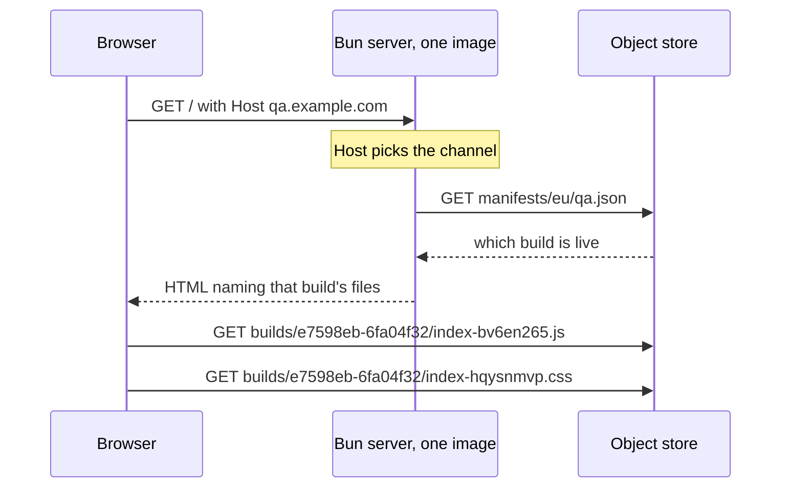

# pointer-deploy

A Preact single-page app whose server holds none of its files.
Deploying it writes one JSON file.

Live: <https://pointer-deploy.fly.dev/>

## What this demonstrates

A normal single-page app pipeline treats the app and the thing that serves it as
one artefact. Change a button label and you build a container image, push it to
a registry, and roll out new machines. Rolling back means doing all of that
again with an older commit.

They do not have to be one artefact. The server can do routing and templating
only, and read which version of the app to serve, per request, from a file.

| On every app change | Normal pipeline | Here |
| --- | --- | --- |
| Build the app | yes | yes |
| Build a container image | yes | no |
| Push it to a registry | yes | no |
| Restart or replace machines | yes | no |
| Change what visitors get | the rollout | one JSON write |
| Roll back | redeploy an older image | write the older JSON back |
| A preview environment | a whole stack | one more JSON file |

So a deploy is this, and nothing else:

```sh
bun run promote qa e7598eb-6fa04f32
```

### The page is five bundles that agree with each other

The shell owns the state — a name, a colour, and a map of namespaced counters.
Four sub-apps read and write it. Two appear on the counters view, two on the
totals view, and the second pair reads counters the first pair created without
the two pairs ever being on screen together.

Each sub-app is its own bundle with its own stylesheet, published separately and
fetched when its view first needs it. That is in tension with sharing state: a
sub-app carrying its own Preact would have its own signals runtime, and the
shell's counters would silently stop re-rendering it. So exactly one thing is
shared, and the manifest carries it:

| | How |
| --- | --- |
| Shell, store, and one entry per shared specifier | One `Bun.build` with splitting, so Preact lands in a single chunk every entry reaches |
| Each sub-app | Its own `Bun.build` with those specifiers `external` |
| Joining them up | The manifest's `imports` becomes the page's import map |

`build.ts` refuses a sub-app that imports anything the import map does not name,
or that stopped importing `preact` and `@pointer/shell` by name. Either means it
bundled its own copy.

That this matters was measured, not assumed. Bundling Preact into each app turns
4 of the 6 browser scenarios red.

### What happens on a request



The server never holds a script or a stylesheet. It is asked which build is
live, and it writes an HTML page pointing at that build. Promoting a different
build changes the answer to that question, so the next visitor gets a different
app from the same running machine.

### What it costs

| | |
| --- | --- |
| A visitor waits for a manifest read | No. It is cached 10 s and served stale while it refreshes |
| A deploy is instant | No. 7.1 – 10.2 s measured, because two caches sit in front of it |
| The store is on the critical path | Only for a cold start. A running server survives an outage on its last good answer |
| Old builds can be deleted | No. A tab opened before the deploy still fetches its own files |
| Anyone who can write the JSON | can run JavaScript on the production origin |

### Compared with

`../ajt-web-app-experiment` is the same app deployed the usual way: ArgoCD to six
clusters, six complete copies of the Kubernetes object set, roughly 79% of the
lines repeated, and a new image for every commit.

## Deploying

```sh
bun run build                      # hashed files into dist/
bun run publish                    # -> builds/<id>/ ; prints <id>. Affects nobody
bun run promote qa   <id>          # the deploy
bun run promote prod <id>
bun run promote prod <previous>    # the rollback. Same command
```

`fly deploy` is not in that list, and `deploying-by-pointer.feature` asserts it:
the machine ids and their `updated_at` timestamps are identical before and after
a promotion.

`publish` writes the manifest **last**, after every file it names is readable.
`promote` refuses any build with no manifest, so a channel cannot point at a
half-uploaded build.

## Measured

| | Value |
| --- | --- |
| Promotion to every visitor seeing it | 4.7 – 10.2 s across eight runs, against a 15 s window |
| Propagation window by construction | 15 s: 5 s Tigris pointer cache + 10 s server cache |
| First request to a fully stopped machine | 4.59 s (wake, boot, cold manifest read) |
| First request to a running machine | 0.32 s |
| Runtime image | 40 MB, no `node_modules`, no `dist/` |

The 4.59 s is a `fly machine stop`, which is the worst case. `auto_stop_machines
= "suspend"` should wake faster; that was not measured.

## Layout

| Path | What it is |
| --- | --- |
| `src/server/origins.ts` | `Host` → channel, `FLY_REGION` → region. Pure |
| `src/server/manifest.ts` | Cached fetch: 10 s TTL, stale-while-revalidate, single-flight |
| `src/server/html.ts` | The shell template |
| `src/server/index.ts` | Three routes and nothing else |
| `src/web/shell/` | The frame: the store (`api.ts`), routing, and the loader that fetches a sub-app |
| `src/web/apps/<name>/` | One sub-app. Its own bundle, its own stylesheet, shares nothing with the others |
| `src/web/vendor/` | One re-export per shared specifier. These are what the import map points at |
| `build.ts` | `Bun.build` → `dist/` with content hashes, records `dist/build.json` |
| `scripts/store.ts` | SigV4 by hand: Bun's `S3Client` cannot set `Cache-Control` |
| `scripts/publish.ts` | `dist/` → `builds/<id>/`. Manifest last |
| `scripts/promote.ts` | `builds/<id>/manifest.json` → `manifests/<region>/<channel>.json` |
| `features/support/world.ts` | The harness: local stub vs live store, and the suite's own channels |
| `scripts/setup-store.ts` | One-off bucket CORS. See below |
| `scripts/falsify.ts` | Breaks the server eight ways; each break must turn one check red |
| `stryker.config.json` | Mutation testing over the server logic |
| `features/` | The specification and the acceptance suite, in one artefact |
| `TODO.md` | Working state, open items, and the traps already paid for |

## Two failure rules, on purpose

`origins.ts` fails **closed** on an unrecognised `Host` — host parsing is the
only thing separating prod from qa, so an unknown host gets a 404 and never a
channel. It fails **open** on an unknown `FLY_REGION` — the machine is running
somewhere, and refusing all traffic is worse than one wrong region. The miss is
logged.

`/healthz` reads no manifest. If health depended on the store, a store outage
would make the platform kill machines that were serving visitors correctly.

## Verifying

```sh
bun test src/server     # 42 unit tests
bun run verify          # 9 @local scenarios, stub store, ~5 s
bun run verify:live     # 18 @live scenarios against Fly and Tigris
bun run verify:browser  # 6 @browser scenarios in a real Chrome, ~16 s
bun run falsify         # 8 architectural mutations, each must turn a check red
bun run mutate          # Stryker: 222 mutants over the server logic, ~40 s
```

`@browser` uses `playwright-core` against the Chrome already on the machine, so
nothing downloads a second browser. Those six scenarios cover what nothing else
can see: five separately published bundles agreeing about one store.

Two kinds of mutation testing, and they cover different things. **Stryker**
mutates operators and literals in the pure logic — 69.91% killed. It found a real
gap: every entry in `FLY_TO_REGION` returned `"eu"`, the same as the fallback, so
deleting the lookup left every test green. **`falsify.ts`** makes the
architectural changes Stryker cannot generate — removing single-flight, making
the health check read the manifest, unsharing the store. Neither replaces the
other.

`@local` covers only what needs an injected failure — an unreachable store, a
corrupt manifest, a counted read. Everything that publishes or promotes is
`@live` against the real store, because a stub that reimplemented those could
pass while the real path was broken.

`falsify` exists because a check that has only ever been green is not evidence.
It found three that proved nothing:

- a "malformed manifest" case whose document was invalid JSON, so manifest
  validation could be deleted and no test noticed;
- a burst test whose 25 requests never overlapped, because the stub answered in
  1 ms;
- and that same burst test after it was made to overlap, which then went red on
  only two runs in five. How many times the server fetches is not observable to
  a visitor, and measuring it through the network measured Bun's connection
  pooling: with one response held open, later fetches queue on the pooled
  connection and never reach the store. The scenario is gone and the unit test,
  which counts an injected fetch directly, catches the same mutation six times
  in six.

## Two channels without a domain

Fly gives one free hostname per app, and `.fly.dev` is Fly's namespace, so a
second channel cannot have a resolvable name until a real domain points here.
Fly forwards the `Host` header to the app untouched, so the channel works today
for anything that can set one:

```sh
curl https://pointer-deploy.fly.dev/                                  # qa
curl -H "Host: prod.pointer-deploy.test" https://pointer-deploy.fly.dev/   # prod
```

Both are answered by one machine, and `channel-selection.feature` asserts that.
`.test` is IANA-reserved and never resolves, which keeps it obvious that no
browser reaches prod yet. A domain is needed for a browser-reachable prod URL,
not for the behaviour.

## The suite deploys, so it deploys somewhere else

`verify:live` publishes throwaway builds and promotes them, because a stub
standing in for `promote` could pass while the real promote path was broken.
Promoting is the deploy. Pointed at `qa` and `prod`, the suite therefore
deployed a scenario's build every time it ran, and the application served a
build marked `alpha` or `beta` until someone promoted a real one.

There are four channels now. Two the application is served from, two the suite
owns:

| Channel | Host | Written by |
| --- | --- | --- |
| `qa` | `pointer-deploy.fly.dev` | an operator |
| `prod` | `prod.pointer-deploy.test` | an operator |
| `test-qa` | `test-qa.pointer-deploy.test` | `verify:live` |
| `test-prod` | `test-prod.pointer-deploy.test` | `verify:live` |

The `.feature` files still say "qa" and "prod": which channels the harness uses
is not part of the specification, so `features/support/world.ts` maps them and
nothing else changes. Two checks stand behind the mapping — `world.promote`
refuses any live target not prefixed `test-`, and the run records what `qa` and
`prod` point at before the first scenario and fails if either moved by the end.
The second repairs nothing on purpose: a restore hook that fails leaves the
channel wrong and reports success.

`verify:browser` still loads `pointer-deploy.fly.dev`, so it reads the real `qa`
channel — no browser can be made to send a `Host` header. It writes nothing.
Promote a build to `qa` before running it, or it checks whatever was last
deployed.

## The bug that only a browser found

The first deployment passed every check — unit tests, both suites, `curl`
returning correct HTML with the right asset URLs — and rendered a blank page.

The document and the bundle are on different origins by design. A cross-origin
`<script type="module">` is fetched in CORS mode, and Tigris sets no
`Access-Control-Allow-Origin` by default. The stylesheet loaded, because `<link>`
is not CORS-restricted, so the background painted and nothing else appeared.
`flyctl` has no CORS flag, so `scripts/setup-store.ts` sets it through the S3
API.

`publishing-a-build.feature` now carries a scenario for it. It was confirmed to
go red with the bucket restricted to another origin, and green again after.

## The bug the clean tree found

Build ids were the git short SHA. Publishing two builds from one commit — the
same source with different build-time configuration — gave both the same id.
The second overwrote the first and both channels served one bundle. Without
`--force` the second would instead have been refused as already published,
which is equally wrong.

An id names an artefact, and the commit does not identify the artefact. It is
now `<source>-<content>`. The suite refuses two scenario builds that publish to
one id, because without that guard every promotion scenario passes by accident:
the channel already serves the id being promoted to it.

## Cold edges

Tigris fills an edge on first request, so the first visitor after a deploy paid
for it — measured once at over 30 s for a file nobody had asked for, which also
showed up as one flaky browser run in four.

`promote.ts` now fetches every file the manifest names before it reports
success: 15 files in about 500 ms. A deploy that leaves the first visitor
waiting has not finished. Pass `--no-warm` to skip it.

The browser suite's mount wait dropped from 60 s to 20 s as a result. The fix
belongs at the source, not in the timeout.

## Not done

| | |
| --- | --- |
| A browser-reachable `prod` URL | Needs a domain pointed at Fly and a certificate. The channel itself works; see above |
| SRI on the script and link tags | `BuildArtifact.hash` is already in hand in `build.ts`. Bucket CORS is set, which SRI needs |
| Content-Security-Policy | One response header |
| Second region | `fly scale count 1 --region iad`. The region is already in the manifest path |
| Asset retention | Nothing is deleted, so nothing can dangle |

Whoever can write `manifests/eu/prod.json` can execute JavaScript on the
production origin. The only writer here is one machine holding the key in a
gitignored `.env.local`. That is fine for an experiment and is not fine once
anyone else uses it: SRI, a CSP, and a scoped write key are the fix.
