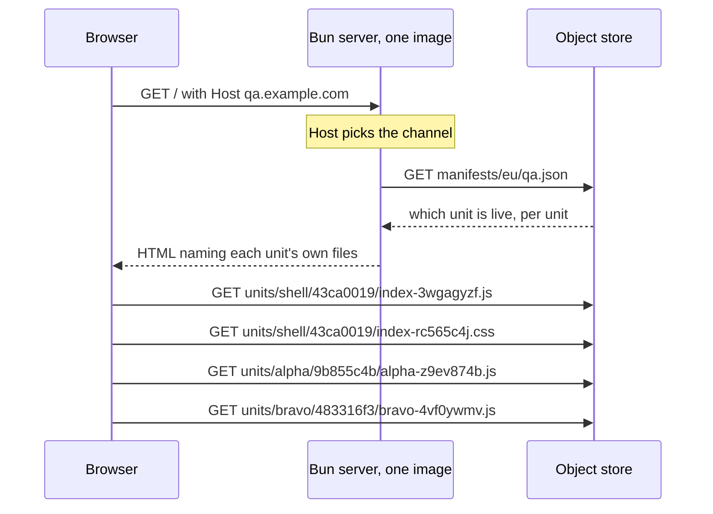

# pointer-deploy

A Preact single-page app whose server holds none of its files.
Deploying it writes one JSON file.

Live: <https://pointer-deploy.fly.dev/>

## What this demonstrates

A normal single-page app pipeline treats the app and the thing that serves it as
one artefact. Change a button label and you build a container image, push it to
a registry, and roll out new machines. Rolling back means doing all of that
again with an older commit.

They do not have to be one artefact. The server can do routing and templating
only, and read which version of the app to serve, per request, from a file.

| On every app change | Normal pipeline | Here |
| --- | --- | --- |
| Build the app | yes | yes |
| Build a container image | yes | no |
| Push it to a registry | yes | no |
| Restart or replace machines | yes | no |
| Change what visitors get | the rollout | one JSON write |
| Roll back | redeploy an older image | write the older JSON back |
| A preview environment | a whole stack | one more JSON file |
| Ship one panel of the page | the whole page ships | one field in that JSON |

So a deploy is this, and nothing else:

```sh
bun run promote qa --app alpha=9b855c4b
```

That moves alpha. The shell and the other three sub-apps stay exactly where
they were, and rolling alpha back afterwards leaves alone whatever was deployed
in between.

### The page is five bundles that agree with each other

The shell owns the state — a name, a colour, and a map of namespaced counters.
Four sub-apps read and write it. Two appear on the counters view, two on the
totals view, and the second pair reads counters the first pair created without
the two pairs ever being on screen together.

Each sub-app is its own **unit**: its own bundle, its own stylesheet, its own id,
published and promoted on its own and fetched when its view first needs it. That
is in tension with sharing state: a sub-app carrying its own Preact would have
its own signals runtime, and the shell's counters would silently stop
re-rendering it. So exactly one thing is shared, and the manifest carries it:

| | How |
| --- | --- |
| Shell, store, and one entry per shared specifier | One `Bun.build` with splitting, so Preact lands in a single chunk every entry reaches |
| Each sub-app | Its own `Bun.build` with those specifiers `external` |
| Joining them up | The manifest's `imports` becomes the page's import map |

`build.ts` refuses a sub-app that imports anything the import map does not name,
or that stopped importing `preact` and `@pointer/shell` by name. Either means it
bundled its own copy.

That this matters was measured, not assumed. Bundling Preact into each app turns
4 of the 6 browser scenarios red.

### What happens on a request



The server never holds a script or a stylesheet. It is asked which units are
live, and it writes an HTML page pointing at each of them. Promoting a different
unit changes one answer to that question, so the next visitor gets a different
app from the same running machine — and only the part that moved is different.

Note the last two lines. Alpha and bravo come from different directories,
written at different times. **One `assetBase` per unit is the whole feature.**
Schema 2 had one base for the entire page, so every file had to come from one
build directory, which is what made the five bundles deploy and roll back
together.

### What it costs

| | |
| --- | --- |
| A visitor waits for a manifest read | No. It is cached 10 s and served stale while it refreshes |
| A deploy is instant | No. 7.1 – 10.2 s measured, because two caches sit in front of it |
| The store is on the critical path | Only for a cold start. A running server survives an outage on its last good answer |
| Old units can be deleted | No. A tab opened before the deploy still fetches its own files |
| A unit can be composed with any other | No. `promote` refuses a composition with no contract in common |
| Anyone who can write the JSON | can run JavaScript on the production origin |

### Compared with

`../ajt-web-app-experiment` is the same app deployed the usual way: ArgoCD to six
clusters, six complete copies of the Kubernetes object set, roughly 79% of the
lines repeated, and a new image for every commit.

## Deploying

```sh
bun run build                                 # five units into dist/units/
bun run publish                               # uploads only what changed. Affects nobody
bun run promote qa --app alpha=9b855c4b       # the deploy
bun run promote qa --app alpha=36226fb9       # the rollback. Same command
bun run promote qa --shell 43ca0019           # the shell alone
bun run promote qa --from-build               # everything just built
```

`fly deploy` is not in that list, and `deploying-by-pointer.feature` asserts it:
the machine ids and their `updated_at` timestamps are identical before and after
a promotion. The image is rebuilt when the *server* changes, which is a
different and much rarer event.

`publish` writes each unit's `unit.json` **last**, after every file it names is
readable. `promote` refuses any unit with no `unit.json`, so a channel cannot
point at a half-uploaded unit.

`promote` reads the channel's current composition, applies only what you named,
and writes the result. That merge is the feature: without it every promote
replaces all five units, and "deploy alpha" silently rolls the other four back
to whatever the operator last had on disk. `falsify.ts` breaks the merge and
requires a scenario to go red.

### A unit id is a hash of that unit's output, and nothing else

The commit is deliberately not in it. It used to be — `<source>-<content>` — and
under per-unit publishing that is wrong: one commit touching only alpha would
change all five ids and republish all five, which removes the point. The commit
identifies the source, not the artefact, so it lives in `unit.json` as
provenance and reaches the served page in the `__BUILD__` block.

The consequence is that publishing is idempotent per unit:

```
$ bun run publish
  shell   43ca0019  unchanged
  alpha   9b855c4b  uploaded 3 files
  bravo   483316f3  unchanged
  charlie 8511a387  unchanged
  delta   d728f064  unchanged
```

## What stops a rollback breaking the page

Composing units means composing combinations that nothing has ever typechecked.
`tsc --noEmit` at HEAD proves the HEAD combination; rolling one unit back is
precisely how you get one it never saw. A shell that renamed an export, put in
front of a six-week-old alpha, is a page where one panel renders an error.

So each unit declares **which contracts it compiles against**, and `promote`
refuses a composition whose sets do not intersect.

A contract is the type surface a sub-app is built against — `@pointer/shell`
and `SubApp` — and **its identity is the content hash of that surface**, never a
number. A number is a claim somebody has to remember to raise, and nothing stops
an edit to a published contract from silently breaking every unit that claimed
the old one. A hash is derived, so that edit produces a different identity
instead, which no unit claims, and the composition falls back to the contract
they do share. `verifyRegistry` re-derives every stored hash from its own files
and refuses a mismatch.

Support is a **set**, not a range or a floor. A set can say "supports the one
from June and the one from August, not the one in between", which is what
support genuinely is.

The sets are generated, never written:

```
$ bun run contract:matrix
         9e79879  571be5c
shell       fail     pass
alpha       pass     fail
bravo       pass     fail
charlie     pass     fail
delta       pass     fail
```

That is one `tsc` per cell, with `@pointer/shell` and `@pointer/subapp`
re-pointed at that contract's `.d.ts` files — the same `paths` mechanism
`tsconfig.json` already uses to point them at the sources. Two adapter files
carry the halves the call sites cannot prove on their own:
`src/web/shell/contract.ts` (the shell provides at least the contract) and
`src/web/apps/<name>/contract.ts` (the app provides `mount`).

Three consequences, and they are why the matrix is worth its cost:

| | |
| --- | --- |
| Nobody can claim a contract they did not compile against | The set is generated output. There is no hand-written claim to get wrong, so it stops being a thing to test and becomes a property |
| An additive change costs nothing | Every adapter still compiles against the new hash, so it joins every set with no new file and no decision. Adding an export to `api.ts` does not force four republishes |
| A breaking change appears as a `fail` column | In the unit that has to move, immediately, rather than in a browser weeks later |

The table above is the real output of making `increment(ns, by = 1)` require
`by`. The shell stops satisfying the old contract; the four apps, which all call
`increment(NS)` with one argument, stop satisfying the new one; the intersection
is empty and `promote` refuses.

`build.ts` refuses to run when the surface at HEAD hashes to something the
registry does not hold, and names the command:

```sh
bun run contract:mint --name counters-2026-08
```

The directory name is for people reading a listing. The hash is the identity.

### What the contract does not cover

| Limit | Why |
| --- | --- |
| A same-name signature change | Covered. This is the case a list of exported *names* would have missed, and hashing the declaration surface catches it |
| A Preact major that breaks an old bundle | **Not covered.** Vendor types resolve from `node_modules` at HEAD, so a cell testing an old app against an old contract compiles against head Preact anyway — the vendor half would be identity with no verification behind it. Folding versions into the hash would instead force all four apps to republish on every patch bump. `unit.json` records the resolved versions and `promote` **warns** on a major mismatch |
| A change in behaviour behind an unchanged type | Not covered, and not coverable this way |

Measured, on this repository: the surface hash is stable across runs, unchanged
by a reworded and reflowed comment, and changed by `increment(ns, by = 1)`
becoming `increment(ns, by: number)`. Normalisation is `tsc
--emitDeclarationOnly --removeComments`, which is weaker than an API report
would give; a reformat that survives that would mint a contract everything still
supports, which costs one registry entry and no false refusal.

## Measured

| | Value |
| --- | --- |
| Promotion to every visitor seeing it | 4.7 – 10.2 s across eight runs, against a 15 s window |
| Propagation window by construction | 15 s: 5 s Tigris pointer cache + 10 s server cache |
| First request to a fully stopped machine | 4.59 s (wake, boot, cold manifest read) |
| First request to a running machine | 0.32 s |
| Runtime image | 40 MB, no `node_modules`, no `dist/` |

The 4.59 s is a `fly machine stop`, which is the worst case. `auto_stop_machines
= "suspend"` should wake faster; that was not measured.

## Layout

| Path | What it is |
| --- | --- |
| `src/server/origins.ts` | `Host` → channel, `FLY_REGION` → region. Pure |
| `src/server/manifest.ts` | Cached fetch: 10 s TTL, stale-while-revalidate, single-flight |
| `src/server/html.ts` | The shell template |
| `src/server/index.ts` | Three routes and nothing else |
| `src/web/shell/` | The frame: the store (`api.ts`), routing, and the loader that fetches a sub-app |
| `src/web/apps/<name>/` | One sub-app. Its own bundle, its own stylesheet, shares nothing with the others |
| `src/web/shell/subapp.ts` | `SubApp`, alone in its own file because it is half the contract |
| `src/web/shell/contract.ts` | The shell's conformance, in one file the matrix can compile |
| `src/web/apps/<name>/contract.ts` | That app's conformance to `SubApp` |
| `src/web/vendor/` | One re-export per shared specifier. These are what the import map points at |
| `contracts/<name>/` | One retained contract: `shell.d.ts`, `subapp.d.ts`, and the hash of the two |
| `build.ts` | Five `Bun.build`s → `dist/units/<name>/`, plus the contract matrix. Records `dist/build.json` |
| `scripts/contract.ts` | Surface emit, the hash, the registry, and the matrix |
| `scripts/store.ts` | SigV4 by hand: Bun's `S3Client` cannot set `Cache-Control` |
| `scripts/publish.ts` | `dist/units/<n>/` → `units/<n>/<id>/`. `unit.json` last, and only what changed |
| `scripts/promote.ts` | Read the composition, merge what was named, test the intersection, write |
| `scripts/e2e-independent-deploy.ts` | The three behaviours, end to end, read off the rendered page |
| `features/support/world.ts` | The harness: local stub vs live store, and the suite's own channels |
| `scripts/setup-store.ts` | One-off bucket CORS. See below |
| `scripts/falsify.ts` | Breaks the server eight ways; each break must turn one check red |
| `stryker.config.json` | Mutation testing over the server logic |
| `features/` | The specification and the acceptance suite, in one artefact |
| `TODO.md` | Working state, open items, and the traps already paid for |

## Two failure rules, on purpose

`origins.ts` fails **closed** on an unrecognised `Host` — host parsing is the
only thing separating prod from qa, so an unknown host gets a 404 and never a
channel. It fails **open** on an unknown `FLY_REGION` — the machine is running
somewhere, and refusing all traffic is worse than one wrong region. The miss is
logged.

`/healthz` reads no manifest. If health depended on the store, a store outage
would make the platform kill machines that were serving visitors correctly.

## Verifying

```sh
bun test src/server        # 53 unit tests
bun run verify             # 9 @local scenarios, stub store, ~5 s
bun run contract:matrix    # 5 units x retained contracts, ~0.8 s
bun run verify:live        # @live scenarios against Fly and Tigris
bun run verify:browser     # 7 @browser scenarios in a real Chrome
bun run falsify            # 13 architectural mutations, each must turn a check red
FALSIFY_LIVE=1 bun run falsify   # including the three that need the real store
bun run e2e                # deploy one app, deploy another, roll the first back
bun run mutate             # Stryker over the server logic
```

An `@live` scenario about **server** behaviour cannot be falsified by a source
edit, because it runs against the deployed image. Two mutations that break
`html.ts` therefore point at unit tests instead, and `falsify.ts` says so at the
mutation. The three live ones that do work break `publish.ts` and `promote.ts`,
which run locally.

`bun run e2e` is the one that answers the question the feature was built for,
and it is the only one that can. The unit tests construct compositions by hand.
The `@live` scenarios read unit ids out of the served HTML, which is the
manifest talking about itself. `e2e` drives the documented commands and then
reads the **rendered DOM** — the marker each sub-app painted — because that is
the only place "alpha moved and bravo did not" is a fact about the application
rather than a fact about a JSON file. It writes only `test-*` channels.

One thing in it is not the deployed machine, and the script says so at the top.
`Host` is forbidden to `setExtraHTTPHeaders` and Fly routes on SNI, so no
browser can reach a `test-*` channel on Fly — the trap this README already
records, met again from the other side. So the browser half runs
`bun src/server/index.ts` locally against the real store, and `origins.ts`
carries `test-qa.localhost` for it, development only. Everything else is real,
and the machine fingerprint is compared before and after.

`@browser` uses `playwright-core` against the Chrome already on the machine, so
nothing downloads a second browser. Those six scenarios cover what nothing else
can see: five separately published bundles agreeing about one store.

Two kinds of mutation testing, and they cover different things. **Stryker**
mutates operators and literals in the pure logic — 69.91% killed. It found a real
gap: every entry in `FLY_TO_REGION` returned `"eu"`, the same as the fallback, so
deleting the lookup left every test green. **`falsify.ts`** makes the
architectural changes Stryker cannot generate — removing single-flight, making
the health check read the manifest, unsharing the store. Neither replaces the
other.

`@local` covers only what needs an injected failure — an unreachable store, a
corrupt manifest, a counted read. Everything that publishes or promotes is
`@live` against the real store, because a stub that reimplemented those could
pass while the real path was broken.

`falsify` exists because a check that has only ever been green is not evidence.
It found three that proved nothing:

- a "malformed manifest" case whose document was invalid JSON, so manifest
  validation could be deleted and no test noticed;
- a burst test whose 25 requests never overlapped, because the stub answered in
  1 ms;
- and that same burst test after it was made to overlap, which then went red on
  only two runs in five. How many times the server fetches is not observable to
  a visitor, and measuring it through the network measured Bun's connection
  pooling: with one response held open, later fetches queue on the pooled
  connection and never reach the store. The scenario is gone and the unit test,
  which counts an injected fetch directly, catches the same mutation six times
  in six.

## Two channels without a domain

Fly gives one free hostname per app, and `.fly.dev` is Fly's namespace, so a
second channel cannot have a resolvable name until a real domain points here.
Fly forwards the `Host` header to the app untouched, so the channel works today
for anything that can set one:

```sh
curl https://pointer-deploy.fly.dev/                                  # qa
curl -H "Host: prod.pointer-deploy.test" https://pointer-deploy.fly.dev/   # prod
```

Both are answered by one machine, and `channel-selection.feature` asserts that.
`.test` is IANA-reserved and never resolves, which keeps it obvious that no
browser reaches prod yet. A domain is needed for a browser-reachable prod URL,
not for the behaviour.

## The suite deploys, so it deploys somewhere else

`verify:live` publishes throwaway builds and promotes them, because a stub
standing in for `promote` could pass while the real promote path was broken.
Promoting is the deploy. Pointed at `qa` and `prod`, the suite therefore
deployed a scenario's build every time it ran, and the application served a
build marked `alpha` or `beta` until someone promoted a real one.

There are four channels now. Two the application is served from, two the suite
owns:

| Channel | Host | Written by |
| --- | --- | --- |
| `qa` | `pointer-deploy.fly.dev` | an operator |
| `prod` | `prod.pointer-deploy.test` | an operator |
| `test-qa` | `test-qa.pointer-deploy.test` | `verify:live` |
| `test-prod` | `test-prod.pointer-deploy.test` | `verify:live` |

The `.feature` files still say "qa" and "prod": which channels the harness uses
is not part of the specification, so `features/support/world.ts` maps them and
nothing else changes. Two checks stand behind the mapping — `world.promote`
refuses any live target not prefixed `test-`, and the run records what `qa` and
`prod` point at before the first scenario and fails if either moved by the end.
The second repairs nothing on purpose: a restore hook that fails leaves the
channel wrong and reports success.

`verify:browser` still loads `pointer-deploy.fly.dev`, so it reads the real `qa`
channel — no browser can be made to send a `Host` header. It writes nothing.
Promote a build to `qa` before running it, or it checks whatever was last
deployed.

## The bug that only a browser found

The first deployment passed every check — unit tests, both suites, `curl`
returning correct HTML with the right asset URLs — and rendered a blank page.

The document and the bundle are on different origins by design. A cross-origin
`<script type="module">` is fetched in CORS mode, and Tigris sets no
`Access-Control-Allow-Origin` by default. The stylesheet loaded, because `<link>`
is not CORS-restricted, so the background painted and nothing else appeared.
`flyctl` has no CORS flag, so `scripts/setup-store.ts` sets it through the S3
API.

`publishing-a-build.feature` now carries a scenario for it. It was confirmed to
go red with the bucket restricted to another origin, and green again after.

## The bug the clean tree found

Build ids were the git short SHA. Publishing two builds from one commit — the
same source with different build-time configuration — gave both the same id.
The second overwrote the first and both channels served one bundle. Without
`--force` the second would instead have been refused as already published,
which is equally wrong.

An id names an artefact, and the commit does not identify the artefact. It became
`<source>-<content>`, and then, when publishing moved to units, `<content>`
alone: keeping the commit in a *unit* id meant one commit touching only alpha
changed all five ids and republished all five. The same argument, taken one step
further than it was the first time. The suite refuses two scenario builds that
publish to one shell id, because without that guard every promotion scenario
passes by accident: the channel already serves the id being promoted to it.

## Cold edges

Tigris fills an edge on first request, so the first visitor after a deploy paid
for it — measured once at over 30 s for a file nobody had asked for, which also
showed up as one flaky browser run in four.

`promote.ts` now fetches every file the units it is moving name, **before** it
writes the pointer — 2 files in about 350 ms for one sub-app. Only what moved:
the rest were warmed by the promote that put them there. Warming before the
write rather than after also closes the window in which a visitor could reach a
cold file. Pass `--no-warm` to skip it.

The browser suite's mount wait dropped from 60 s to 20 s as a result. The fix
belongs at the source, not in the timeout.

## Not done

| | |
| --- | --- |
| A browser-reachable `prod` URL | Needs a domain pointed at Fly and a certificate. The channel itself works; see above |
| SRI on the script and link tags | `BuildArtifact.hash` is already in hand in `build.ts`. Bucket CORS is set, which SRI needs |
| Content-Security-Policy | One response header |
| Second region | `fly scale count 1 --region iad`. The region is already in the manifest path |
| Asset retention | Nothing is deleted, so nothing can dangle |
| Contract pruning | `contracts/registry.json` retains by hand. Pruning is a decision, never automatic |
| Concurrent promotes | `promote` is a read-modify-write with no compare-and-set, so two at once can lose one. One operator. Tigris conditional writes are unchecked; an `If-Match` on the ETag would close it |

Whoever can write `manifests/eu/prod.json` can execute JavaScript on the
production origin. The only writer here is one machine holding the key in a
gitignored `.env.local`. That is fine for an experiment and is not fine once
anyone else uses it: SRI, a CSP, and a scoped write key are the fix.
